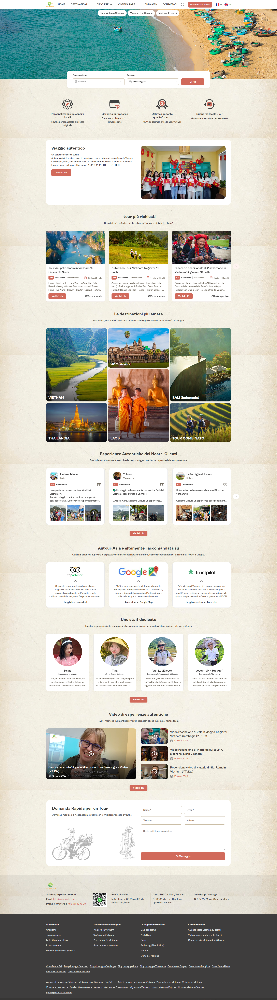
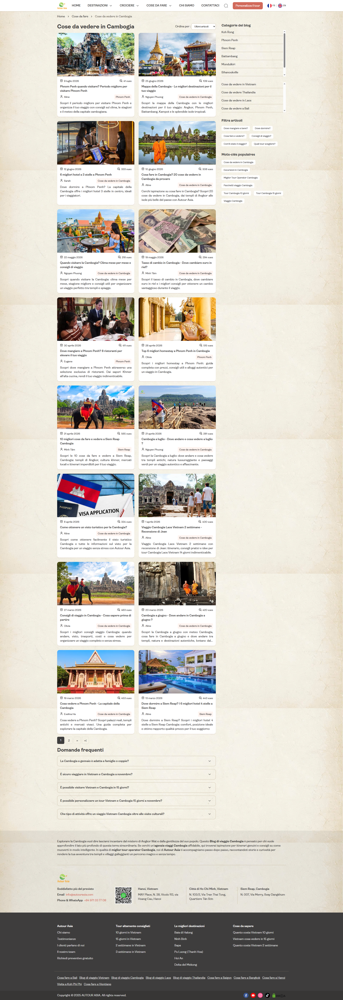
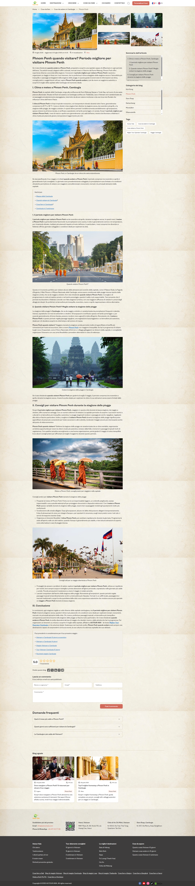

# Đặc tả chi tiết từng loại trang (Page Specs)

Mỗi trang được mô tả theo: **Mục đích → Ảnh tham chiếu → Layout/thành phần (top-to-bottom) → Dữ liệu cần → Ghi chú SEO/UX**.
Ảnh tham chiếu nằm ở `image_clone/` cùng thư mục docs — mở song song khi code.

---

## A. Trang chủ (Home) — `/`

**Ảnh tham chiếu:**

**Mục đích:** Giới thiệu thương hiệu, dẫn traffic vào tour bán chạy, tạo niềm tin (trust), thu thập lead.

**Thành phần theo thứ tự (đã đối chiếu ảnh thật):**
1. Header (logo, mega menu DESTINAZIONI/CROCIERE/COSE DA FARE, CHI SIAMO, CONTATTACI, search icon, CTA "Personalizza il tour", language flags)
2. **Hero block**: ảnh nền lớn (full-width, tỉ lệ rộng ~21:9) + **thanh pill chọn nhanh danh mục tour** đặt sát mép trên hero (VD "Tour Vietnam 10 giorni | Vietnam 2 settimane | Vietnam 15 giorni" — pill có thể active/hover đổi màu)
3. **Search box** đặt đè lên phần dưới hero (nổi trên ảnh, nền trắng bo góc): 2 dropdown **Destinazione** + **Durata** + nút **Cerca** (màu cam/đỏ nổi bật)
4. **4 USP icon badges** — hàng ngang 4 icon: Personalizzabile da esperti locali / Garanzia di rimborso / Ottimo rapporto qualità-prezzo / Supporto locale 24/7 (icon đơn sắc, tiêu đề bold, mô tả 1 dòng nhỏ bên dưới)
5. **"Viaggio autentico" — Company intro block**: card trắng bo góc, 2 cột (trái: tiêu đề + đoạn giới thiệu công ty + số giấy phép lữ hành quốc tế + nút "Vedi di più"; phải: ảnh đội ngũ/văn phòng)
6. **"I tour più richiesti" (Best-seller Tours)** — **chỉ 3 card** dạng carousel/grid ngang, mỗi card:
   - Ảnh đại diện
   - Tên tour (link)
   - Rating: badge số "5.0" + "Eccellente" + "| N recensioni" + badge duration bên phải ("10 giorni 9 notti")
   - Đoạn tóm tắt lộ trình 1 dòng (chuỗi địa danh nối bằng "-")
   - 2 link cuối: "Offerta speciale" (text link) + nút "Vedi di più" (button)
7. **"Le destinazioni più amate"** — **bento/mosaic grid không đều** (không phải grid đều): 1 ô lớn bên trái (Vietnam), các ô nhỏ hơn xếp phải (Cambogia, Bali, Thailandia, Laos, Tour combinato) — mỗi ô là ảnh nền + tên quốc gia đặt góc dưới trái dạng overlay có nền mờ
8. **"Esperienze Autentiche dei Nostri Clienti"** — carousel 3 card testimonial hiển thị cùng lúc (có nút mũi tên "›" điều hướng): avatar tròn + tên khách + quốc gia (cờ nhỏ), badge rating "5.0 Eccellente", icon dấu ngoặc kép, đoạn quote 2-3 dòng, dải 3 ảnh thumbnail cuối card (ảnh thứ 3 hiện "+N" nếu còn nhiều ảnh) + nút "Vedi di più" chung cho cả section
9. **"Autour Asia è altamente raccomandata su"** — 3 card ngang: logo (TripAdvisor/Google Maps/Trustpilot) + icon quote + đoạn review ngắn + link text ("Leggi altre recensioni"/"Recensioni su Google Map"/"Leggi recensioni su Trustpilot")
10. **"Uno staff dedicato"** — grid 4 nhân sự: avatar tròn, tên, chức danh (italic), đoạn bio ngắn bị cắt "..." + nút "Vedi di più" chung
11. **"Video di esperienze autentiche"** — layout 2 cột: video lớn bên trái (thumbnail + nút play + tiêu đề + ngày), danh sách 2-3 video nhỏ bên phải (thumbnail nhỏ + tiêu đề + ngày) + nút "Vedi di più"
12. **"Domanda Rapida per un Tour" (Quick Inquiry)** — card nền trắng: tiêu đề + mô tả ngắn bên trái kèm 2 hình minh hoạ vẽ tay (người đạp xe chở hoa, người gánh hàng — phong cách illustration mộc mạc gợi văn hoá bản địa); form bên phải: Nome*, Email*, Telefono*, Indirizzo (không bắt buộc), textarea message, nút "Dà Messaggio"
13. Footer (xem `01-sitemap-ia.md` mục 4)

**Dữ liệu cần:** danh sách tour nổi bật (featured=true, giới hạn 3), danh sách quốc gia/destination (bento layout cần field `sizeHint: "large"|"normal"` để biết ô nào lớn), testimonial gallery, danh sách nhân sự, video, pill danh mục nhanh (liên kết tới TourCategory phổ biến nhất).

---

## B. Trang danh mục Tour (Tour Listing / Category) — `/tours/{country}` hoặc `/tours/{country}/{topic}`

**Ảnh tham chiếu** (case cụ thể: "Tour Vietnam 10 giorni"):

**Mục đích:** Trang hub SEO chính — vừa là danh sách sản phẩm, vừa có nội dung dài để rank từ khóa.

**Thành phần (đã đối chiếu ảnh thật — có một số khác biệt quan trọng so với bản .com):**
1. Banner ảnh full-width
2. **Card trắng bo góc đè lên banner** chứa: Tiêu đề H1 ("Tour Vietnam 10 giorni") + breadcrumb ngay bên dưới — đây là pattern UI khác với giả định "breadcrumb rời rạc", cần làm thành 1 khối overlay thống nhất
3. **Layout 2 cột**: Sidebar filter trái (~280px) + Danh sách tour phải

   **Sidebar "Filtra per" (trái):**
   - **Durate** (checkbox): Meno di 7 giorni / 7-10 giorni / 11-15 giorni / Oltre 16 giorni
   - **Stile di viaggio** (checkbox — nhóm filter mới, phong phú hơn nhiều so với "First Destination" ở bản .com): Tour di lunga durata, Molti patrimoni, Natura e alcuni homestay, Cultura e storia, Vacanza equilibrata, Vacanza al mare, Luna di miele, Vacanze in famiglia, Escursioni e trekking, Tour combinato multi-paesi, Tour per piccoli gruppi
   - 2 nút cuối: "Annulla" (reset, text link) + "Applica" (button, màu cam)

   **Khu vực danh sách (phải):**
   - Badge nổi bật góc trái phía trên danh sách: "Top 2 - 2026" (badge số lượng/năm, không phải "Top 10" cố định — số lượng động theo số tour thực có)
   - Dropdown "Ordina per: Popolarità" ở góc phải cùng hàng (sort: Popolarità / Prezzo / Novità...)
   - **List card tour** (không phải grid), mỗi card bố cục ngang (ảnh trái ~40%, nội dung phải ~60%):
     - Ảnh
     - Tên tour (H3, link)
     - Hàng badge: rating tròn "5.0" + "Eccellente" + "| N recensioni", cách 1 khoảng là badge duration (icon lịch + "10 giorni 9 notti")
     - **Quote review** (italic, icon dấu ngoặc kép ở đầu): trích 1 câu review + "- Tên khách"
     - "📍 Luoghi da visitare:" + chuỗi địa danh
     - "Il tour inizia da: {X}" / "Termina alle: {Y}"
     - Hàng cuối: "Attrazioni principali ⌄" (accordion mở rộng danh sách điểm nhấn) + link "Offerta speciale" + nút "Vedi di più"
4. **Rating tổng trang** — hiển thị to: số điểm (5.0) + 5 sao + "N recensioni" ngay dưới danh sách, canh giữa
5. **Đoạn giới thiệu SEO** (rich text, có bold từ khoá) mô tả chung về danh mục này (VD: "Un Tour Vietnam 10 giorni è l'itinerario ideale per...")
6. **"Domande frequenti" (FAQ accordion)** — 4-5 câu hỏi/trả lời dạng accordion (chevron mở/đóng), câu hỏi liên quan tới chủ đề trang (khí hậu, chi phí, visa...)
7. Esperienze Autentiche dei Nostri Clienti (dùng chung)
8. Autour Asia è altamente raccomandata su (dùng chung)
9. Domanda Rapida per un Tour (dùng chung) + hình minh hoạ
10. Footer

**Khác biệt quan trọng so với đặc tả ban đầu (bản .com):**
- Không thấy khối "Price/Pax" filter riêng trong ảnh này — có thể ẩn/gộp vào "Stile di viaggio", cân nhắc vẫn giữ price filter ở data model nhưng để optional trên UI.
- FAQ đặt **ngay sau đoạn intro SEO**, phía trên "Esperienze Autentiche" — thứ tự này khác với vị trí FAQ ở Tour Detail (đặt cuối trang), cần lưu ý khi implement layout riêng cho từng loại trang.
- Long-form content dạng "Things you should know" của bản .com có thể được rút gọn thành 1 đoạn ngắn hơn + đẩy trọng tâm sang FAQ — tuỳ chọn cả 2 nếu muốn tối đa hoá SEO.

**Dữ liệu cần:** danh sách tour theo category + facet filter (duration, travelStyle[]), block FAQ riêng theo từng category, đoạn rich text SEO riêng theo category.

---

## C. Trang chi tiết Tour (Tour Detail) — `/tours/{country}/{slug}`

*(Không có ảnh chụp riêng trong bộ ảnh gửi lần này — áp dụng đặc tả từ khảo sát nội dung thực tế autourasia.com đã có ở bản trước, kết hợp phong cách UI quan sát được từ `danh-muc-tour.png` để đồng bộ style: card bo góc, badge rating tròn, màu CTA cam/đỏ, FAQ accordion cùng style.)*

**Mục đích:** Trang bán hàng chính — thuyết phục khách điền form yêu cầu báo giá.

**Thành phần:**
1. **Gallery ảnh** — ảnh lớn + thumbnail strip cuộn ngang bên dưới, click để đổi ảnh chính
2. Card breadcrumb + tiêu đề (đồng bộ style với mục B.2)
3. **Tab điều hướng nội bộ (anchor links, sticky khi scroll)**: Overview | Highlight | Itinerary | What's included | Customer Reviews
4. **Info box tóm tắt**: badge rating tròn + "Eccellente" + review count, Tour code, Duration, Start in, Finish in, Places to visit (full list)
5. **Bản đồ tuyến đường (Tour Map)** — ảnh map custom vẽ tuyến, "Click to view map" mở lightbox
6. **Highlights section**: đoạn mô tả SEO dài + bullet list 5-7 điểm nhấn
7. **Itinerary — "Expand All"** — accordion theo từng ngày (tiêu đề ngày + bữa ăn B/L/D, icon phương tiện, ảnh, nội dung, overnight)
8. **What's Included / What's Excluded / Notes** — 3 khối bullet list
9. **Sticky booking sidebar**: tên tour, rating, badge "Offerta speciale"/giảm giá, nút CTA "Price Request", 4 USP badge thu nhỏ, logo TripAdvisor
10. Esperienze Autentiche dei Nostri Clienti (dùng chung)
11. "Other Similar Tours" — carousel liên quan
12. Autour Asia è altamente raccomandata su (dùng chung)
13. **Customer Reviews** — Q&A style (avatar + tên + ngày + rating + câu hỏi + trả lời)
14. **Domande frequenti (FAQ)** — đặt cuối trang (khác vị trí so với Tour Listing)
15. Domanda Rapida per un Tour + Footer

**Ghi chú kỹ thuật:**
- Anchor tab nên dùng smooth-scroll + `IntersectionObserver`.
- Schema.org: `TouristTrip`/`Product` + `AggregateRating` + `Review[]` + `BreadcrumbList` + `FAQPage`.

---

## D. Danh mục Cruise — `/cruises/{type}` và Chi tiết Cruise — `/cruises/{type}/{slug}`

Dùng chung pattern với mục B/C, khác dữ liệu đặc thù: loại thuyền, hạng cabin, cảng khởi hành, số đêm trên thuyền. Xem chi tiết field ở `03-data-models.md`.

---

## D2. Catalogue dịch vụ (5 cụm) — Hub / Listing / Detail

**Triển khai ViTravel (2026-07):** vé tàu, máy bay, lưu trú, vui chơi, dịch vụ khác. **Lead-gen** — giá “từ” + CTA báo giá / WhatsApp / liên hệ; **không checkout**. Named routes: `services.hub`, `services.index`, `services.show`.

### D2.1 Hub cụm — `/ve-tau-cao-toc`, `/ve-may-bay`, `/luu-tru`, `/ve-vui-choi`, `/dich-vu-khac`

**Mục đích:** Landing SEO cụm + điều hướng nhanh tới danh mục con.

**Thành phần:**
1. `x-layout.page-header` — banner, H1, subtitle, breadcrumb (1 cấp hub)
2. Hàng **pill danh mục** (`btn-chip`) — mỗi `service_category` + count badge
3. Danh sách dịch vụ nổi bật / toàn cụm — card ngang `x-service.card` (reuse typography tour listing)
4. Khối FAQ chung (`service_listing_faqs` từ seed)
5. Quick Inquiry + footer (dùng chung)

**Dữ liệu:** hub copy từ `config/seo.php` + StaticPage template; `services[]` filter theo `cluster`.

### D2.2 Danh mục dịch vụ — `/{hub}/{category}`

**Pattern:** reuse **`.listing-layout`** (sidebar trái ~280px + list phải) như tour listing.

**Thành phần:**
1. Page header — breadcrumb: Hub → Tên danh mục
2. Sidebar: danh sách category cùng cụm (active state)
3. List card ngang `x-service.card` — rating, badge, location, highlights rút gọn, giá “từ”, CTA
4. SEO intro category (`intro` từ translation) + FAQ listing (nếu có)
5. Quick Inquiry + footer

### D2.3 Chi tiết dịch vụ — `/{hub}/{category}/{slug}`

**Pattern:** reuse **`.detail-layout`** + sidebar booking (tương tự tour detail).

**Thành phần (`x-service.detail`):**
1. Page header + gallery/placeholder theo cụm icon
2. Tóm tắt, điểm nhấn (bullet ✓), thuộc tính theo cụm (`attrs`: điểm đi/đến, hạng ghế, check-in, địa điểm…)
3. Bảng **ServiceOption** (biến thể giá) khi có
4. Inclusion / exclusion / notes
5. **Sticky sidebar:** giá “từ”, rating, CTA Liên hệ / WhatsApp / Yêu cầu báo giá (không “Add to cart”)
6. FAQ riêng dịch vụ + dịch vụ liên quan (`related`)
7. Quick Inquiry + footer

**Ghi chú:** Admin CRUD dịch vụ **chưa có** — nội dung từ seed; roadmap CMS sau.

---

## E. Travel Guide / Blog

Đây là mục được nâng cấp nhiều nhất so với bản khảo sát trước — hệ thống blog thực tế có chiều sâu content-hub rõ rệt.

### E.1 Trang danh mục Blog — `/travel-guide/{country}` hoặc `/travel-guide/{country}/{destination}`

**Ảnh tham chiếu** (case cụ thể: "Cose da vedere in Cambogia"):

**Thành phần:**
1. Breadcrumb thường (không phải card overlay như Tour Listing): "Home › Cose da fare › Cose da vedere in Cambogia"
2. Tiêu đề H1 + dropdown "Ordina per: Ultimi articoli" (góc phải cùng hàng H1)
3. **Layout 2 cột**: Grid bài viết trái (rộng hơn) + Sidebar phải (hẹp hơn)

   **Grid bài viết (2 cột con bên trong khu vực trái)**, mỗi card:
   - Ảnh
   - 📅 Ngày đăng + 👁 số lượt xem ("41 vues")
   - Tiêu đề (H3, 2 dòng)
   - 👤 Tên tác giả + badge tag chuyên mục (VD "Phnom Penh", màu cam nhạt)
   - Đoạn trích (excerpt) 2 dòng

   **Sidebar phải:**
   - **"Categorie del blog"** — danh sách điểm đến/thành phố dạng list cuộn dọc (Koh Rong, Phnom Penh, Siem Reap, Battambang, Mondulkiri, Sihanoukville...), có thanh scroll riêng nếu dài, mục đang active tô đậm; bên dưới có thêm danh sách theo **quốc gia** (Cose da vedere in Vietnam/Thailandia/Laos/a Bali)
   - **"Filtra articoli"** — nhóm nút tag hình chữ nhật bo góc theo LOẠI nội dung: "Dove mangiare e bere?" / "Dove dormire?" / "Cosa fare e vedere?" / "Consigli di viaggio?" / "Com'è stato il viaggio?" / "Quali tour scegliere?"
   - **"Mots-clés populaires"** — tag cloud từ khoá SEO (pill nhỏ, nhiều màu nhạt): "Cose da vedere in Cambogia", "Escursioni in Cambogia", "Miglior Tour Operator Cambogia", "Pacchetti viaggio Cambogia", "Tour Cambogia 10 giorni", "Tour Cambogia 15 giorni", "Viaggio Cambogia"
4. **Pagination** (dạng số trang, style đơn giản: 1 [2] › »)
5. **"Domande frequenti"** — FAQ accordion (5 câu, liên quan chủ đề + kết hợp quốc gia khác, VD "È possibile visitare Vietnam e Cambogia in 15 giorni?" — cho thấy FAQ có thể trộn nội dung cross-country để dẫn traffic sang tour kết hợp)
6. Đoạn văn SEO dài cuối trang (giới thiệu về "Blog di viaggio {Country}" + nhắc "agenzia viaggi {Country}" — chèn nhiều biến thể từ khoá tự nhiên)
7. Footer

**Dữ liệu cần:** `Article[]` theo `destination`/`country`, danh sách `BlogCategory` (theo destination — sidebar), danh sách `ContentTypeTag` (Dove mangiare/Dove dormire/...), danh sách `PopularKeywordTag` (tag cloud), block FAQ riêng theo trang danh mục.

### E.2 Trang chi tiết bài viết Blog — `/travel-guide/{country}/{destination}/{slug}`

**Ảnh tham chiếu** (case cụ thể: "Phnom Penh quando visitare?"):

**Thành phần:**
1. Breadcrumb: "Home › Cose da fare › Cose da vedere in Cambogia › Phnom Penh"
2. **Gallery đầu bài**: 1 ảnh lớn bên trái + lưới nhỏ 4 ảnh phụ bên phải (giống gallery kiểu "hero collage")
3. 📅 Ngày đăng + "Aggiornato il {ngày}" (ngày cập nhật) + 👁 lượt xem
4. Tiêu đề H1
5. **Layout 2 cột cho phần thân bài**: Nội dung trái (rộng) + Sidebar phải

   **Sidebar phải:**
   - **"Sommario dell'articolo"** (mục lục) — danh sách số thứ tự (I, 1, 2, 3...) auto-generate từ heading trong bài, click nhảy tới section
   - **"Categorie del blog"** — list điểm đến (giống trang danh mục, mục hiện tại tô màu cam)
   - **"Tags"** — pill nhỏ (VD: Cose da vedere in Cambogia, Cosa fare a Phnom Penh, Miglior Tour Operator Cambogia, Viaggio Cambogia)

   **Nội dung bài (trái):**
   - Đoạn mở đầu
   - Heading dạng số La Mã/số thường xen kẽ ("I. Clima e meteo a Phnom Penh, Cambogia", "1. Il periodo migliore per...", "2. Quando visitare...", "II. Consigli...", "III. Conclusione")
   - Ảnh chèn giữa các đoạn, có **caption in nghiêng dưới ảnh**
   - Box liên kết nội bộ giữa bài: "Vedi di più:" + danh sách link (Mappa della Cambogia, Cosa vedere in Cambogia, Cose da fare in Cambogia, Cambogia in 2 settimane) — internal link đặt ngay trong luồng đọc, không chỉ ở cuối bài
   - Bullet list (mẹo/lời khuyên) xen giữa đoạn văn
   - Kết bài "Conclusione" + đoạn internal-link cuối cùng dẫn sang: Vietnam e Cambogia in 2 settimane / Vietnam in Cambogia 15 giorni / Viaggio Vietnam Cambogia / Tour Vietnam Cambogia 15 giorni / Pacchetti viaggio Cambogia (**đây chính là cầu nối Content→Product quan trọng nhất của cả hệ thống**, cần model hoá thành field `relatedTours`/`relatedArticles` rõ ràng)
6. **Rating cuối bài** (5.0 + số lượt đánh giá) + **nút chia sẻ mạng xã hội** (Facebook, Twitter/X, icon share khác)
7. **Form bình luận** — "Lascia un commento": Nome e cognome*, Email*, Telefono, textarea Commento*, nút "Posta il commento"
8. **"Domande frequenti"** — FAQ riêng của bài viết (3 câu, rất cụ thể theo chủ đề bài)
9. **"Blog uguale" (bài liên quan)** — 2 card cùng chuyên mục
10. Footer

**Dữ liệu cần:** `Article` (đầy đủ field ở `03-data-models.md`) + `Comment[]` + `relatedTourIds[]` + `relatedArticleIds[]` + TOC tự sinh từ nội dung (không cần lưu riêng nếu parser tự generate từ H2/H3).

---

## F. Trang About Us (Chi Siamo) — `/about-us` (hoặc `/chi-siamo`)

**Ảnh tham chiếu:**

**Mục đích:** Xây dựng niềm tin thương hiệu — đây là trang tổng hợp dài, không phải static page đơn giản.

**Thành phần (top-to-bottom theo ảnh thật):**
1. Banner + card breadcrumb + tiêu đề "Chi siamo" (đồng bộ style overlay như Tour Listing)
2. **"Viaggio autentico"** — giống hệt block ở Home (intro công ty + số giấy phép + ảnh đội ngũ)
3. **"Uno staff dedicato"** — team grid 4 người (đồng bộ Home) + nút "Vedi di più"
4. **"La nostra missione" / "la nostra visione"** — 2 block ảnh minh hoạ kiểu biển gỗ khắc chữ ("Vision" có la bàn, "Missions"), mỗi block có tiêu đề + đoạn mô tả ngắn bên cạnh
5. **"Impegno nei valori fondamentali"** — **sơ đồ vòng tròn 4 giá trị cốt lõi**, bố trí: 1 vòng tròn trung tâm ghi "Impegno nei valori fondamentali", 4 giá trị xếp quanh (Dedizione, Empatia, Sincerità, Responsabilità) nối bằng đường tròn đồng tâm; mỗi giá trị có icon ✓ + tiêu đề + mô tả 1 dòng, bố trí 2 bên trái/phải sơ đồ → đây là 1 **diagram component riêng**, có thể build bằng SVG/CSS circle layout
6. **"Politica di vendita"** — tiêu đề + đoạn điều khoản (VD chính sách giảm giá trẻ em) + ảnh minh hoạ gia đình đi du lịch + nút "Vedi di più"
7. **"Perché scegliere noi?"** — ảnh bên trái (điện thoại hiển thị app/website) + bên phải: tiêu đề + danh sách lý do (1. Esperti locali in viaggi su misura, 2. Garanzia di rimborso, 3. Eccellente rapporto qualità-prezzo, 4. Assistenza disponibile 24/7, 5. Eco-turismo responsabile e sostenibile...) + nút "Vedi di più"
8. **4 USP icon badges** (lặp lại, đồng bộ Home)
9. Autour Asia è altamente raccomandata su (dùng chung)
10. Esperienze Autentiche dei Nostri Clienti (dùng chung)
11. **"I nostri referenti dall'estero"** (Reference persons abroad) — grid 3 card: ảnh chân dung, tên (VD "Mr. Claude MILLET"), icon email + địa chỉ email, icon phone + số điện thoại, icon Skype + Skype ID
12. Video di esperienze autentiche (dùng chung)
13. Domanda Rapida per un Tour (dùng chung) + Footer

**Dữ liệu cần:** ngoài các model dùng chung (TeamMember, ExperienceAlbum, ExperienceVideo), cần thêm:
- `CompanyValue` (name, icon, description) — cho sơ đồ giá trị cốt lõi
- `SalesPolicy` (richText)
- `ReasonToChooseUs[]` (title, description) — cho block "Perché scegliere noi?"
- `ReferencePersonAbroad` (name, photo, email, phone, skype, country)

**Ghi chú:** Trang này nên build từ các **section component độc lập, có thể tái sắp xếp** (không hard-code thứ tự cứng trong 1 component khổng lồ) — vì đây là trang dễ được yêu cầu chỉnh sửa thứ tự/nội dung nhất trong toàn site.

**CMS (2026-07):** About-only content đã wire DB + admin đa ngôn ngữ qua `CompanyProfile` / translations + CRUD `CompanyValue`, `ReasonToChooseUs`, `ReferencePerson`. Shared Home blocks (company-intro, team-grid, usp, review-platforms, testimonials, video-showcase) vẫn dùng `HomeSection` / related. Public payload: `ViewDataService::aboutPage()` (+ fallback `SampleData::aboutPage()`). Admin (host `admin.vitravel.*`): `/cong-ty` (story + chrome + ảnh), `/gia-tri`, `/ly-do-chon`, `/dai-dien`.

---

## G. Trang Contact (Contattaci) — `/contact-us`

**Ảnh tham chiếu:**

**Mục đích:** Kênh liên hệ trực tiếp, đơn giản, ít ma sát nhất site.

**Thành phần (thực tế đơn giản hơn giả định ban đầu):**
1. Breadcrumb: "Home › Contatti"
2. Tiêu đề lớn "AUTOUR ASIA" (tên thương hiệu làm H1, không phải "Contact Us")
3. Đoạn giới thiệu ngắn ("Vuoi restare in contatto? Qui trovi tutti i modi per raggiungerci.")
4. Thông tin: "Indirizzo: ..." + "Email: ..." (dạng text đơn giản, không phải card)
5. **"Inviaci un messaggio"** — form: Nome*, Email*, Telefono*, Indirizzo*, textarea Messaggio* (4 field ngắn + textarea, KHÔNG có field "Chủ đề" như giả định trước), nút "Dà Messaggio"
6. Footer (đầy đủ, gồm contact strip có QR code + footer 4 cột)

**Ghi chú:** Không thấy Google Maps embed trong ảnh chụp được — có thể trang thật có nhưng nằm ngoài phần chụp, hoặc site gốc cố tình tối giản. **Khuyến nghị khi clone**: vẫn nên thêm Google Maps embed cho từng văn phòng nếu muốn UX tốt hơn bản gốc, đây là cải tiến hợp lý chứ không phải sai lệch.

**Dữ liệu cần:** danh sách văn phòng (đã có ở `Office` — bổ sung model này, xem `03-data-models.md`), form field tối giản theo đúng ảnh.

---

## H. Trang Customize Tour (Personalizza il tour) — `/customize-tour`

**Ảnh tham chiếu:**

**Mục đích:** Form lead quan trọng nhất site — thu thập yêu cầu tour riêng chi tiết.

**Thành phần (3 khối card trắng bo góc, xếp dọc):**

**Khối 1 — "Le tue informazioni di viaggio":**
- **Numero di viaggiatori** — 3 nhóm stepper (nút [−] số [+]) cạnh nhau: "Adulti (>10 anni)", "bambini (4-10 anni)", "Neonati (0-3 anni)"
- **"Quanti giorni hai a disposizione per questo viaggio?"** — text input (placeholder "Esempio: 10 giorni") + **"Quando prevedi di arrivare?"** — date picker, 2 field cạnh nhau
- **"Quale Paese desideri visitare?"** — checkbox ngang 1 hàng: VIETNAM, THAILANDIA, CAMBOGIA, LAOS, BALI (INDONESIA)
- **"Che tipo di alloggio preferisci?"** — checkbox ngang: Superiore (hotel 3*), Prima classe (hotel 4*), Deluxe (hotel 5*), Mi consigliate (tuỳ chọn "để chúng tôi tư vấn giúp")
- **"Qual è il tuo budget stimato per il viaggio (esclusi i voli internazionali dal tuo paese)?"** — input số có prefix icon "€" (currency, nên đổi thành dropdown chọn tiền tệ khi làm đa thị trường) + dropdown "Per persona / Per gruppo"

**Khối 2 — "Le tue informazioni personali":**
- **Genere** — radio 2 lựa chọn: Signore / Signora
- Nome* / Cognome* (2 cột)
- Email* / Numero di telefono* (2 cột)
- Nazionalità* (dropdown chọn quốc gia) / Città* (text input) (2 cột)

**Khối 3 — "Altre esigenze particolari":**
- Textarea tự do (placeholder: "Condividi più dettagli su ciò che desideri; ci aiuterà a preparare un itinerario su misura per te...")

**Cuối form:**
- Dòng cam kết: "Uno dei nostri consulenti di viaggio ti contatterà entro 24 ore lavorative. Controlla la tua email!"
- Nút CTA lớn, canh giữa: "Invia richiesta"

Footer (đầy đủ) bên dưới.

**Dữ liệu cần:** model `CustomTourRequest` (xem field cụ thể ở `03-data-models.md` — đã cập nhật đầy đủ theo đúng field trong ảnh, khác với field giả định "multi-step form" ở bản trước — thực tế đây là **form 1 trang dài**, không phải wizard nhiều bước).

**Ghi chú UX:** Đây là form dài nhất site nhưng vẫn để 1 trang duy nhất (không chia bước) — chỉ dùng khối card để phân đoạn trực quan. Validate từng field required (đánh dấu `*`) trước khi submit, hiển thị lỗi inline.

---

## I. Trang Our Team, Reviews, Experience Gallery/Video

Các trang này ở bản .it được **nhúng làm block trong About Us / Home** thay vì trang riêng biệt rõ ràng trong bộ ảnh — nếu bạn muốn có URL riêng (như bản .com: `/our-team.html`, `/customers-reviews`, `/experience-gallery`, `/experience-video`) thì tái sử dụng chính các component "Uno staff dedicato", "Esperienze Autentiche", "Video di esperienze autentiche" đã mô tả, chỉ hiển thị **đầy đủ danh sách** (không giới hạn số lượng như khi nhúng ở trang khác) + thêm filter/pagination nếu danh sách dài.

### I.1 Hồ sơ thành viên đội ngũ — `/doi-ngu/{slug}`

**Mục đích:** Trang CV đầy đủ của từng thành viên (port UI từ trainer profile).

**URL:** SEO `team_member` dưới hub `team_hub` (`/doi-ngu`). Named route list giữ `/doi-ngu`.

**Thành phần:**
1. Breadcrumb: Đội ngũ → {Tên}
2. Sidebar: avatar, huy hiệu xác minh, tên, vai trò, sao (SEO rating), CTA Liên hệ → `/lien-he`
3. Thông tin cá nhân: khu vực, năm KN, ngôn ngữ, email, phone
4. Main: `bio_html`, thống kê (Khách đồng hành / Tour dẫn dắt / Giải thưởng), thành tích, skill bars, bằng cấp, timeline kinh nghiệm, gallery hoạt động

**Component:** `x-team.profile` · CSS namespace `.team-profile`

**Dữ liệu:** `TeamMember` + child tables (achievements, skills, experiences/items, degrees/items, activity_images) — xem `03-data-models.md` §8.

---

## J. 404 / Not Found

Trang lỗi thân thiện: thông báo, ô search, link về Home/Tours phổ biến. (Không có ảnh tham chiếu riêng — giữ nguyên đặc tả tối giản.)
