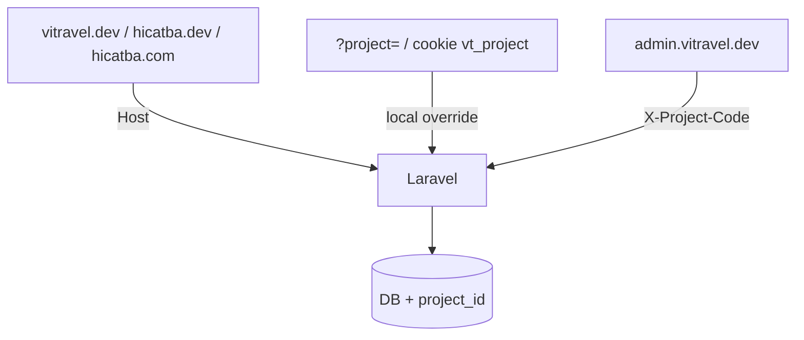

# Multi-project — hướng dẫn thực tế (dev + admin)

> Mục tiêu: **một** Laravel + **một** Admin, nhiều bộ dữ liệu (`project_id`).  
> Đọc file này khi cần seed / đổi dự án trên local hoặc production.  
> **Deploy VPS aaPanel:** [`13-deploy-aapanel-vps.md`](13-deploy-aapanel-vps.md).

---

## 0. Khái niệm nhanh (đừng nhầm)

| Khái niệm | Làm gì? |
|-----------|---------|
| `project/seed_{name}.php` | File nội dung bootstrap (vd. `seed_hicatba.php`, `seed_vitravel.php`) |
| Bảng `projects` + `project_domains` | Project runtime: `code`, tên, **domain** map Host |
| Admin dropdown **Dự án** | Gửi `X-Project-Code` → CRUD đúng data |
| Public Host / `?project=` | Chọn data hiển thị trên trang khách |

**Không còn trong `.env`:** `PROJECT_SEED`, `COMPANY_*` (brand lấy từ `company_profiles` theo project).

Tuỳ chọn:

| `.env` | Khi nào |
|--------|---------|
| `PROJECT_DEFAULT_CODE=vitravel` | Host không khớp domain nào → fallback project này |
| `PROJECT_PUBLIC_QUERY_OVERRIDE=true` | Bật `?project=` + cookie + dropdown góc trái (mặc định = `APP_DEBUG`) |
| `PROJECT_PUBLIC_QUERY_OVERRIDE=false` | Production: chỉ đổi bằng domain thật |

---

## 1. Seed

### Seed tất cả dự án

```bash
cd /var/www/html/vitravel.dev
php artisan migrate:fresh --seed --force
```

- Tự tìm mọi `project/seed_*.php` → lần lượt `project:seed {name}`
- Kỳ vọng có cả `vitravel` và `hicatba`

```bash
php artisan tinker --execute="echo App\Models\Project::pluck('code')->join(', ');"
```

> `migrate:fresh` **xóa hết** DB — chỉ dùng local khi chấp nhận mất data.

### Seed / cập nhật một project

```bash
php artisan project:seed hicatba
# Gắn / cập nhật nhiều domain (local + prod):
php artisan project:seed hicatba --domain=hicatba.dev --domain=hicatba.com --name="Cát Bà Hub"
php artisan project:ensure hicatba --domain=hicatba.dev --domain=hicatba.com --name="Cát Bà Hub"
```

Domain mặc định của Cát Bà Hub lấy từ seed `meta.domains` → **`hicatba.dev`** (local) + **`hicatba.com`** (prod), kèm `www.*`.  
ViTravel: theo `APP_URL` / meta seed (thường `vitravel.dev`).

**Không cần** `PROJECT_SEED` trong `.env`.

---

## 1b. Multi-domain (local + production)

Một project (`code` = `hicatba`) có thể gắn **nhiều** Host cùng lúc. Seed `meta.domains` được phép liệt kê cả local **và** prod:

```php
'primary_domain' => 'hicatba.dev',
'domains' => array(
  'hicatba.dev',
  'www.hicatba.dev',
  'hicatba.com',
  'www.hicatba.com',
),
```

Sau khi import DB lên server, **không cần re-seed** — chỉ thêm domain prod:

```bash
php artisan project:domain hicatba --add=hicatba.com --add=www.hicatba.com
php artisan project:domain hicatba --list
# optional set primary on prod:
php artisan project:domain hicatba --primary=hicatba.com
```

Hoặc ensure với nhiều `--domain=`:

```bash
php artisan project:ensure hicatba --domain=hicatba.dev --domain=hicatba.com
```

Lệnh quản lý domain:

| Việc | Lệnh |
|------|------|
| Liệt kê | `php artisan project:domain hicatba --list` |
| Thêm | `php artisan project:domain hicatba --add=…` (lặp được) |
| Xóa | `php artisan project:domain hicatba --remove=…` |
| Đặt primary | `php artisan project:domain hicatba --primary=hicatba.com` |

---

## 2. Public đổi dự án — vì sao trước dễ “không đổi được”

Bạn mở `https://vitravel.dev` → Host map **chỉ** ViTravel (qua `project_domains`).

Nếu Cát Bà Hub chỉ gắn domain khác mà bạn vẫn đứng trên `vitravel.dev` **không** dùng `?project=` / dropdown → trang vẫn hiện ViTravel. Đó là đúng hành vi Host→project, không phải bug seed.

### Cách dùng ngay trên local (`APP_DEBUG=true`)

1. **Dropdown “Dự án”** góc dưới trái trang public (khi có ≥ 2 project).
2. Hoặc mở URL trực tiếp (cookie `vt_project` giữ lựa chọn các trang sau):

```text
https://vitravel.dev/?project=hicatba
https://vitravel.dev/?project=vitravel
```

3. **Production:** đặt `PROJECT_PUBLIC_QUERY_OVERRIDE=false` (hoặc `APP_DEBUG=false`) — lúc đó **chỉ** đổi bằng domain thật:

| URL | Project |
|-----|---------|
| `https://vitravel.dev` | ViTravel |
| `https://hicatba.dev` / `https://hicatba.com` | Cát Bà Hub (`code=hicatba`) |

### Local: 2 domain → cùng một Laravel

Trong hosts (Windows: `C:\Windows\System32\drivers\etc\hosts`):

```text
127.0.0.1  vitravel.dev
127.0.0.1  hicatba.dev
```

Nginx / site local: cả hai `server_name` trỏ **cùng** document root Laravel.

Đảm bảo domain đã gắn trong DB:

```bash
php artisan project:ensure vitravel --domain=vitravel.dev
php artisan project:ensure hicatba --domain=hicatba.dev --domain=www.hicatba.dev --domain=hicatba.com --domain=www.hicatba.com
```

- `https://vitravel.dev` → ViTravel  
- `https://hicatba.dev` → Cát Bà Hub  

---

## 3. Admin đổi dự án

1. Mở `https://admin.vitravel.dev/` (hoặc `http://localhost:3100`), đăng nhập.
2. Topbar → dropdown **Dự án** (custom Select UI đồng bộ form) → chọn `Cát Bà Hub (hicatba)` hoặc `ViTravel (vitravel)`.
3. Mọi API gửi `X-Project-Code: …`.

**Link “Xem trang” / slug trên list từ admin:** `publicPageUrl()` chọn origin theo domain của dự án đang chọn — local ưu tiên `*.dev`, prod ưu tiên `*.net` / `*.com` (từ `projects.domains` / `primary_domain` trong payload login/`me`). Chỉ khi vẫn dùng `NEXT_PUBLIC_SITE_ORIGIN` dùng chung mới gắn `?project={code}`. Mode: suy ra từ SITE_ORIGIN, hoặc ép `NEXT_PUBLIC_PUBLIC_HOST_MODE=local|prod`. Tắt query: `NEXT_PUBLIC_PUBLIC_PROJECT_QUERY=0`. Public chỉ cần `PROJECT_PUBLIC_QUERY_OVERRIDE` khi xem trên host dùng chung.

```bash
cd /var/www/html/admin.vitravel.dev && npm run build
# → out/ — Nginx root admin host (không sync vào Laravel public/he-thong)
```

| Endpoint | Cần `X-Project-Code`? |
|----------|----------------------|
| `POST /auth/login`, `GET/PUT /auth/me`, `GET /projects` | Không |
| Packages, media, company, users, … | Có (+ kiểm tra permission) |

RBAC / user admin: [`docs/12-admin-users-rbac.md`](12-admin-users-rbac.md).

---

## 4. Cheat sheet lệnh

| Việc | Lệnh |
|------|------|
| Xóa DB + seed mọi `seed_*.php` | `php artisan migrate:fresh --seed --force` |
| Seed thêm / cập nhật 1 project | `php artisan project:seed hicatba --domain=hicatba.dev --domain=hicatba.com` |
| Chỉ gắn domain | `php artisan project:ensure hicatba --domain=hicatba.dev --domain=hicatba.com` |
| Quản lý domain | `php artisan project:domain hicatba --list` / `--add=` / `--remove=` / `--primary=` |
| Xem projects + domain | `php artisan tinker --execute="print_r(App\Models\Project::with('domains')->get(['id','code','name','primary_domain'])->toArray());"` |
| Build admin | `cd /var/www/html/admin.vitravel.dev && npm run build` |

Profiles hiện có:

| `code` | File seed | Domain local / prod gợi ý |
|--------|-----------|---------------------------|
| `vitravel` | `project/seed_vitravel.php` | `vitravel.dev` |
| `hicatba` | `project/seed_hicatba.php` | `hicatba.dev` (local) · `hicatba.com` (prod) |
| `phuquy` | `project/seed_phuquy.php` | `phuquy.dev` (local) · `phuquy.net` (prod) |
| `culaocham` | `project/seed_culaocham.php` | `culaocham.dev` (local) · `culaocham.net` (prod) |

---

## 5. Kiến trúc ngắn



| Thành phần | Path |
|------------|------|
| Context | `App\Support\ProjectContext` |
| Scope Eloquent | `BelongsToProject` |
| Public resolve | `ResolveProjectFromHost` (query → cookie → Host → default → first) |
| Public UI switch | `resources/views/components/layout/project-switcher.blade.php` |
| Admin resolve | `ResolveAdminProject` |
| Seed 1 profile | `php artisan project:seed {profile}` |
| Seed all | `DatabaseSeeder` discover `seed_*.php` |
| Domain CLI | `php artisan project:domain {code}` |

Media upload: `projects/{code}/…`.

---

## 6. Checklist site mới (production)

1. Copy `project/seed_vitravel.php` (hoặc seed đảo gần nhất) → `seed_{code}.php`, sửa brand + `meta.primary_domain` / `meta.domains` (local + prod nếu cần). Giữ shape listing: `tour_categories[].subtitle` / `seo_body`, `listing_hubs.*.seo_body` — xem `project/README.md`.
2. `php artisan project:seed {code} --domain=example.com --name="..."`.
3. DNS + SSL; Nginx `server_name` → cùng root PHP.
4. Sau import DB: `php artisan project:domain {code} --add=prod.example --primary=prod.example` (không cần re-seed).
5. Admin: chọn project → CRUD. Public: domain thật (tắt query override).
6. Kiểm URL chủ đề tour: `/tours/{country}/{topic}` (SEO type `tour_category`).
