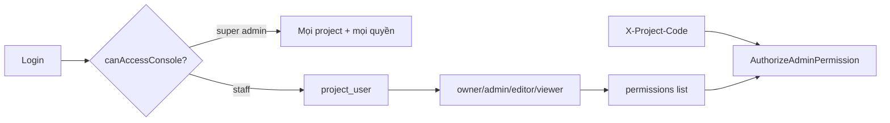

# Admin Users & RBAC (multi-project)

> Phân quyền admin đồng bộ với multi-project. Triển khai 2026-08-05.

## Mô hình

| Lớp | Nơi lưu | Ý nghĩa |
|-----|---------|---------|
| Vai trò hệ thống | `users.role` | `admin` / `super_admin` = toàn hệ thống; `staff` = theo dự án |
| Vai trò dự án | `project_user.role` | `owner` \| `admin` \| `editor` \| `viewer` |
| Quyền chi tiết | mở rộng từ role + `project_user.permissions` JSON | `grant[]` / `deny[]` |
| Catalog | `config/admin_permissions.php` | permission keys, role matrix, route map, nav map |



- **Đăng nhập:** user `is_active` và (super admin **hoặc** có ≥ 1 project active).
- **API nội dung:** `ResolveAdminProject` + `AuthorizeAdminPermission` (map method/path → `module.action`).
- **Frontend:** `can(permission)` từ `user.projects[].permissions`; sidebar ẩn mục không đủ quyền.

## API

| Method | Path | Quyền | Ghi chú |
|--------|------|-------|---------|
| PUT | `/auth/me` | đã đăng nhập | Hồ sơ: name, email, đổi mật khẩu |
| GET | `/users/meta` | `users.view` | roles, permission groups, projects gán được |
| GET | `/users` | `users.view` | list + filter |
| POST/PUT/DELETE | `/users[/{id}]` | `users.manage` | CRUD + sync `projects[]` |

Payload gán dự án:

```json
{
  "name": "…",
  "email": "…",
  "password": "…",
  "role": "staff",
  "is_active": true,
  "projects": [
    {
      "project_id": 1,
      "role": "editor",
      "permissions": { "grant": ["leads.delete"], "deny": [] }
    }
  ]
}
```

## UI admin

| Trang | Path |
|-------|------|
| Hồ sơ của tôi | `/account/` |
| Danh sách user | `/settings/users/` |
| Form user | `/settings/users/form/?id=` |

Sidebar: avatar/tên → hồ sơ; menu **Người dùng** (Cài đặt) chỉ hiện khi có `users.view`.

## Seed / migrate

```bash
php artisan migrate --force
# admin seed vẫn role=admin (super) + attach mọi project
```

Tạo biên tập viên: Admin → Người dùng → role **Nhân sự** → gán project + vai trò **Biên tập**.
