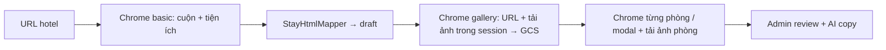

# Lưu trú (Accommodation / cluster `stay`)

Tài liệu hệ thống cho **trang chi tiết chỗ nghỉ** — UI public, admin, AI enrich, và **crawler Booking.com**.

## Kiến trúc

Lưu trú dùng entity **`services`** với `cluster = stay` (không tách bảng riêng):

```
stays_hub (SEO)
  └── service_categories (theo khu vực: Phú Quốc, Đà Nẵng…)
        └── services (cluster stay)
              ├── service_translations
              ├── service_options (hạng phòng)
              ├── attrs JSON (tiện ích, chính sách, nearby…)
              ├── faqs
```

Public URL: `/dich-vu/luu-tru/{category}/{slug}` (route `services.show`, cluster `stay`).

Trang chi tiết **không** dùng `components/service/detail` — dùng **`components/stay/detail`** (gallery + title card, tabs, hộp trắng cùng pattern tour/dịch vụ).

Config: `config/stay.php` · `config/services_catalog.php` (`stays_hub`).

---

## Schema seed (`project/seed_*.php`)

Mở rộng item trong key `services` khi `cluster` = `stay`:

| Field | Mô tả |
|-------|--------|
| `star_rating` | 1–5 (hạng sao khách sạn) |
| `location_label` | Địa chỉ ngắn / khu vực (translation) |
| `attrs.property_type` | `hotel` \| `resort` \| `villa` \| `homestay` \| `apartment` \| `boutique` \| `hostel` \| `bungalow` \| `glamping` \| `camping` \| `floating` \| `cabin` |
| `attrs.address` | Địa chỉ đầy đủ (hiện cạnh vị trí) |
| `attrs.check_in` / `check_out` | Giờ nhận/trả phòng (VD `15:00`) |
| `attrs.amenities` | `string[]` — tiện ích phẳng (fallback nếu không có `amenity_groups`) |
| `attrs.highlight_badges` | `string[]` — pill nổi bật dưới tổng quan (Beachfront, WiFi…) |
| `attrs.amenity_groups` | `{ [groupKey]: string[] }` — **box tiện ích** theo nhóm (`config/stay.php` `amenity_groups`) |
| `attrs.nearby_groups` | `{ [groupKey]: [{ name, distance, icon?, category? }] }` — lân cận theo nhóm (`landmark` / `beach` / `transport` / …) |
| `attrs.review_scores` | `[{ tag, score }]` — tag chuẩn `config/stay.php` `review_score_tags` (staff, wifi…) + điểm 0–10; sẵn sàng filter listing |
| `attrs.cancellation_policy` | Chính sách huỷ/đổi (text) |
| `attrs.child_policy` / `extra_bed_policy` / `age_restriction` | Trẻ em, giường phụ, tuổi tối thiểu |
| `attrs.pet_policy` / `smoking_policy` | Thú cưng / hút thuốc (property) |
| `attrs.payment_policy` / `payment_cards` | Thanh toán + `string[]` thẻ (Visa, Mastercard…) |
| `attrs.id_required_policy` | Giấy tờ check-in |
| `content` | HTML «Về chỗ nghỉ» (AI được viết) |
| `options[]` | Hạng phòng — xem schema overlay bên dưới |
| `faqs[]` | FAQ đặt phòng |

**Hạng phòng (`options[]`) — overlay khi click:**

| Field | Mô tả |
|-------|--------|
| `code`, `name`, `price_from`, `capacity` | Định danh + giá từ + sức chứa |
| `description` | Mô tả dài (overlay) — AI được viết, không thêm tiện ích bịa |
| `amenities` | `string[]` phẳng (thẻ trên card + fallback nhóm) |
| `attrs.unit_type` | `hotel_room` \| `entire_apartment` \| `entire_villa` \| `entire_place` \| `private_room` \| … (`config/stay.php` `unit_types`) |
| `attrs.size_sqm` | Diện tích m² |
| `attrs.view` | View ngắn (Hướng biển) |
| `attrs.bathroom_count` / `bedroom_count` | Số phòng tắm / ngủ |
| `attrs.smoking` | Hút thuốc **theo hạng phòng** |
| `attrs.bed` / `attrs.beds` | Label ngắn, hoặc bố trí theo phòng: `[{ name, items: [{ type, count, label }] }]` |
| `attrs.highlights` | Badge overlay (Bếp riêng, Hồ bơi riêng, Ban công…) |
| `attrs.amenity_groups` | Box tiện nghi **cấp phòng** (kitchen / bathroom / view / general / …) |
| `attrs.photos` | `[{ url, alt }]` hoặc `string[]` — gallery overlay |
| `attrs.comfort_score` / `comfort_reviews` | “Giường thoải mái, 8.8 – dựa trên 72 đánh giá” |
| `attrs.room_id` / `attrs.hash` | ID Booking (`589108809`) + `#RD…` — `code` = `bk-{room_id}` khi có |
| `attrs.crawl_dates` | `{ checkin, checkout, nights }` — ngày dùng khi cào rate table |
| `attrs.rate_options[]` | Nhiều lựa chọn giá **cùng hạng phòng** (xem dưới) |
| `price_from` | Min `price_per_night` trong `rate_options` (khi có bảng giá) |

**`attrs.rate_options[]` (một dòng = một `tr[data-block-id]` trong `#hprt-table`):**

| Field | Mô tả |
|-------|--------|
| `block_id` | Khóa rate Booking |
| `price` / `price_per_night` / `nights` / `currency` | Tổng kỳ / giá đêm / số đêm crawl |
| `price_strikethrough` | Giá gạch (nếu có) |
| `taxes_included` | Đã bao gồm thuế/phí |
| `breakfast` | `{ included, label, extra_price? }` |
| `cancellation` / `prepayment` | `{ refundable?, title, description? }` (+ chi tiết từ `#policyModal_{block_id}`) |
| `meals_detail` / `deals` / `max_rooms` | Bữa ăn chi tiết, badge deal, số phòng chọn được |

Cùng hạng phòng thường có 2+ rate (chỉ phòng / kèm bữa sáng) chia sẻ một `th[rowspan]`. Modal phòng (`rp-content`) chỉ bổ sung mô tả/ảnh/tiện nghi — **không** xoá `rate_options`.

Key nhóm tiện ích (property + room): `popular`, `bathroom`, `bedroom`, `view`, `kitchen`, `living`, `media`, `outdoor`, `wellness`, `pool_beach`, `dining`, `family`, `accessibility`, `safety`, `parking`, `general`, `business`, `other`. Crawler nên **giữ nguyên label nguồn** trong từng mảng; public chỉ group + hiển thị. Key lạ vẫn hiện (label = key).

**An toàn seed:** `ServiceCatalogSeeder` dùng `updateOrCreate` theo `code` (project-scoped). Hạng phòng upsert theo `service_id` + `code` — không `delete()` toàn bộ options. `StaySeed::complete()` điền content/policies/FAQ mặc định nếu seed thiếu; FAQ riêng trong file seed được giữ và gộp thêm câu hỏi check-in / giá / giấy tờ nếu chưa có.

Chạy lại từng dự án (không `migrate:fresh`). **An toàn trên server** — chỉ catalogue dịch vụ/lưu trú, không đụng bài viết/tour (tránh lỗi slug SEO trùng):

```
php artisan project:seed hicatba --only=services
php artisan project:seed phuquy --only=services
php artisan project:seed phuquoc --only=services
php artisan project:seed culaocham --only=services
php artisan project:seed vitravel --only=services
```

Không dùng `--fresh-project`. `project:seed` đầy đủ (không `--only`) vẫn fail nếu ContentSeeder/TourCategorySeeder trùng slug.

Mỗi profile có chỗ nghỉ demo đầy đủ trong `project/seed_{profile}.php` (Cát Bà 6, Phú Quý 6, Phú Quốc 8, Cù Lao Chàm 7, ViTravel 8).

---

## Public UI (Booking-style)

Component: `resources/views/components/stay/detail.blade.php` · CSS: `resources/css/components/stay-detail.css`

| Section | Nội dung |
|---------|----------|
| Gallery + title card | Chỉ ảnh **đã có media** (GCS) hoặc URL nội bộ — **không** hotlink Booking/`bstatic` (bị chặn nên không xem được) |
| Tabs | Tổng quan · Tiện ích · Hạng phòng · Giới thiệu · Vị trí · Chính sách · FAQ |
| Tổng quan | Một panel: `.detail-facts` + **điểm theo hạng mục** (con bên dưới). **Không** «Thư viện ảnh», **không** blockquote review |
| Tiện ích / Vị trí | `.stay-feature-flow` (CSS columns) — mỗi nhóm cao theo nội dung, **không** grid card stretch bằng nhau |
| Hạng phòng | Bảng kiểu Booking: cột phòng (tên → modal, scarcity, sức chứa, giường, badge) + mỗi rate = giá cố định / chính sách / Đặt phòng → **modal** 2 cột (gallery + mô tả/tiện nghi), flush trên–dưới có lề 2 bên |
| Giới thiệu | `.detail-content` |
| Chính sách | `.detail-facts` — **không** inclusions / exclusions / notes / bảng giá |
| Sidebar | `x-stay.booking-sidebar` — giá từ + Đặt phòng → `#phong` (không báo giá 24h) |
| Admin attrs | Tiện ích nhóm / lân cận nhóm / điểm tag: thẻ + drawer riêng (`StayStructuredAttrsEditors`) |

ViewData: `ViewDataService::attachStayPayload()` — `rooms` (`StayFacilities::mapRoom` + lọc ảnh public), `amenityGroups`, `nearbyGroups`, `reviewScores`, `highlightBadges`, `policies`. Stay **không** gắn `featuredQuote` / fallback quote.

---

## Admin

Form: `admin` → **Dịch vụ → Lưu trú → Chi tiết** (`cluster=stay`).

- Public scarcity: `scarcity_active` + JS random 1–5 («Chúng tôi còn N phòng») — an toàn HTML cache; modal dùng chung
- Rate: `save_percent` tính từ giá gạch / giá bán lúc crawl; `deal_key` (mặc định `seasonal` = Ưu Đãi Mùa Du Lịch) chọn lại trong admin
- Cancel/prepay: chuẩn hoá tương đối («Hủy miễn phí trước 3 ngày», «Thanh toán trước khi đến») qua `StayRateCopy`

- Khi service đã có `id`: drawer **Lưu hạng phòng** / Copy / Xóa gọi API riêng ngay; chỗ nghỉ mới chỉ áp dụng vào form đến khi Lưu
- API:
  - `PUT /api/v1/admin/services/{id}` — `attrs` **merge**, `options[]` sync (kèm `rate_options`, comfort, scarcity, crawl meta)
  - `POST /services/{id}/options` · `PUT …/options/{optionId}` · `POST …/options/{optionId}/duplicate` · `DELETE …/options/{optionId}`
- AI: nút **AI lưu trú** — meta/SEO + bài giới thiệu (content) + FAQ; **không** để AI sửa tiện ích / hạng phòng / chính sách

---

## AI enrich (3 luồng — form admin)

| Stage | Prompt key | Output |
|-------|------------|--------|
| `meta` | `enrich_stay_meta` | title, location, seo_* |
| `property` | `enrich_stay_property` | **chỉ** `content` HTML dài (SEO) + figure placehold.co — đọc amenity/nearby/rooms/policies làm context, **không** ghi đè attrs/options |
| `faq` | `enrich_stay_faq` | faqs |

API: `POST /api/v1/admin/ai/enrich-stay` · body `{ stage, fields, locale, provider?, instructions? }`

Service: `App\Services\AI\StayEnrichService`

Sync prompt: `php artisan ai:sync-prompts` (bắt buộc sau khi sửa `resources/ai/prompts/enrich_stay_*.php`)

**Luồng dữ liệu client:** biến `live` merge sau mỗi stage. Property **không** merge `attrs` / `options` — facts khách sạn chỉ do crawl/admin.

---

## Crawler Booking.com (đã triển khai)

Mục tiêu: **Lưu trú → Crawler Booking.com** — chọn danh mục, dán **URL 1 chỗ nghỉ** (test) hoặc **URL listing**, Chrome (Puppeteer) mở trang → **luôn lưu `source_url`** → lọc HTML → **map thủ công `StayHtmlMapper`** (selector từ dump trang chi tiết, không AI) → draft chỗ nghỉ **là trang con của danh mục** (`slug_full` = `{slug_full danh mục}/{slug}`).

AI chỉ dùng sau khi đã có draft: **AI lưu trú** trên form chỗ nghỉ (copy/SEO), không extract schema từ HTML.

Booking.com gần như không trả HTML cho HTTP bot. Crawler mặc định dùng **Chrome** (`scripts/stay-crawl/browser.cjs`). **Xem thao tác trên màn hình:** `STAY_CRAWL_HEADLESS=false`. Trên **WSL không dùng chrome.exe** (lỗi vsock); dùng Chrome Linux trong distro + cửa sổ WSLg (`DISPLAY=:0`). Nếu không có WSLg, crawler tự fallback headless. VPS để `STAY_CRAWL_HEADLESS=true`. Proxy bật trên form admin hoặc `--proxy` (env `STAY_CRAWL_PROXY_*`). HTML dump (Save As) vẫn dùng được khi Chrome/captcha chặn.

**Cài môi trường VPS aaPanel (vitravel.net):** Node 20+, `npm ci` trong `scripts/stay-crawl`, lib Chrome, `.env` headless/proxy, smoke test — [`17-stay-crawl-vps-aapanel.md`](17-stay-crawl-vps-aapanel.md).

**Skeleton** (cuộn được nhưng gallery / phòng / tiện ích / xung quanh không hydrate): trên WSL máy nhà **không bắt buộc proxy** (cùng IP với Chrome Windows). Thường do fingerprint Puppeteer — header `sec-ch-ua` giả đụng Client Hints Chrome thật, hoặc fallback headless (UA `HeadlessChrome`). Log `pack.debug.network.hint`: `fingerprint_or_lazy` = Chrome/Puppeteer; `proxy_or_ip` = GraphQL 403/429 (cần proxy residential, nhất là VPS); `api_ok_wait_dom` = API OK. `.env` chưa có `STAY_CRAWL_PROXY_HOST` thì công tắc proxy trên form không chạy.

Selector map bám dump mẫu `data-html.txt` (trang chi tiết Booking, không commit bắt buộc): title `h2.pp-header__title`, sao `quality-rating`, địa chỉ `PropertyHeaderAddressDesktop`, mô tả `property-description`, tiện ích phổ biến `property-most-popular-facilities-wrapper`, highlights `.property-highlights`, điểm `review_list_score_breakdown`, hạng phòng `rt-name-link` + `rooms_table`, ảnh gallery, check-in/out `#hotelPoliciesInc`. **Gallery modal:** Chrome click gallery → `return-to-grid-button` / `gallery-modal-grid` / `gallery-grid-photo-action-{id}` (ID → `max1024x768/{id}.jpg`, đóng `sub-page--close-button`). **Phòng:** click `rt-name-link` → chờ `rp-content` (`rp-room-title`, `rp-room-size`, `rp-description`, `rp-facilities`, `roomPagePhotos` background-image). **Xung quanh:** `#surroundings_block` / `data-testid="location-block-container"` → `poi-block` + `poi-block-list` (không dùng class hash). **Tiện nghi nhóm:** `data-testid="facility-group-container"` + `facility-group-icon` (nhóm không có `<ul>` vẫn lấy ghi chú trong `h3`, vd. Internet / chỗ đậu xe).



Pipeline Chrome **tách phiên** (không nhồi gallery + phòng vào cùng lần mở trang):

1. **Luồng chính `basic`:** đợi JS → scroll tới cuối → mở «Tất cả tiện nghi» → map title/địa chỉ/điểm/nearby/chính sách + **amenity_groups đầy đủ**. Tạo draft ngay. **Không** import featured quote / review text OTA.
2. **Luồng phụ gallery:** mở lại URL → click thư viện (`GalleryGridViewModal` / `gallery-grid-photo-action-{id}`) → **thu thập URL nguồn** → **tải binary trong phiên Chrome** (`page.request`, cùng cookie/TLS) → ghi `storage/app/tmp/stay_crawl_img_*` → PHP `StayCrawlImageImporter` upload GCS → `media_attachments` gallery + cover. `attrs.photos[]` = `{ url, alt, media_id, source_url }` (`source_url` = CDN Booking để audit/re-crawl).
3. **Luồng phụ phòng:** mở lại URL **đã gắn ngày crawl** (tháng kế: Thứ 2 → Thứ 4, 2 đêm + guest params) → lấy `#hprt-table` (`hprt_html`) + `{ name, hash, room_id }` → **import sớm** hạng phòng + `rate_options[]` → mỗi `process-next` mở modal `#RD…` → scrape `[data-testid="rp-content"]` (ảnh/tiện nghi) → merge **không** xoá `rate_options`.

Admin gọi `process-next` lặp đến khi `enrich.gallery` và `enrich.rooms` = `done`. Log enrich: `gallery_uploaded`, `gallery_chrome_downloaded`.

### Ngày crawl (rate table)

Bảng `#hprt-table` chỉ hiện đủ rate khi URL có `checkin`/`checkout`. Crawler luôn ghi đè:

- Check-in = **Thứ 2 đầu tiên của tháng kế tiếp**
- Check-out = **Thứ 4** cùng tuần (`nights: 2`)
- Guests: `group_adults=2`, `req_adults=2`, `no_rooms=1`, children = 0

Logic: `computeStayCrawlDates()` / `withStayDates()` trong `scripts/stay-crawl/browser.cjs`. Pack mang `crawl_dates` → gắn `attrs.crawl_dates` trên từng hạng phòng.

### Vì sao không dùng `Http::get` từ PHP làm đường chính?

Booking CDN (`cf.bstatic.com`) thường **chặn request server** (không cookie phiên / fingerprint bot) dù Chrome đang xem được ảnh. URL ảnh còn có **chữ ký `?k=&o=`** — nếu crawler chỉ giữ `…/759082737.jpg` (bỏ query) thì tải sẽ 403 dù mở gallery trong Chrome.

**Cách vượt:** thu thập URL **đầy đủ** từ `img.currentSrc` / `background-image` trong gallery/modal phòng → tải song song (mặc định 8 luồng) qua `page.request` trong Puppeteer → upload GCS → xóa file tạm. HTTP Guzzle chỉ fallback.

Public (`StayFacilities::shouldExposePublicPhoto`) **không** hiện hotlink Booking nếu chưa có `media_id`.

### Luồng phòng qua hash + rate table

Khi `rooms_list`, crawler lấy `hprt_html` (`#hprt-table`) + `{ name, hash: "#RD…", room_id }` từ `rt-name-link` / `data-room-id`. Import HPRT trước (một `service_option` / room type, nhiều `rate_options`). Mỗi bước `process-next` (room) mở modal qua hash — chờ `rp-content`, scrape tiện ích + ảnh — merge vào option cùng `code`/`room_id`.

### Admin (một form, hai chế độ)

Trang: **Lưu trú → Crawler Booking.com** (`/services/stay-crawler/`).

Chạy lại URL đã có: API `409 STAY_CRAWL_EXISTS` + modal. **Cải thiện** (`rerun=improve`) giữ draft; chọn **`from`** để bắt đầu từ khúc nào:

| `from` | Hành vi |
|--------|---------|
| `basic` (mặc định) | Cào lại property → import (merge) → gallery → phòng |
| `gallery` | Giữ draft; chỉ gallery → phòng |
| `rooms` | Bỏ gallery; `rooms_list` (HPRT/rate) → modal phòng |
| `rooms_modals` | Giữ hash/`rooms_total`; chỉ scrape lại từng modal |

**Xóa sạch** (`rerun=replace`) và **admin xóa chỗ nghỉ** dùng chung `ServicePurgeService::purge()`: force-delete service + options/FAQ/SEO/bảng giá/reviews/featured + **orphan media trên GCS** (gallery/cover attachments **và** `attrs.photos` / ảnh hạng phòng chỉ có `media_id`) + clear HTML cache theo `slug_full`. Không soft-delete chỗ nghỉ (tránh rác). CLI: `--rerun=improve|replace --from=gallery`.

| Chế độ | URL | Hành vi |
|--------|-----|---------|
| **1 chỗ nghỉ (test)** | `…/hotel/{cc}/{slug}.html` | Job 1 item → fetch → map HTML → import. Dùng để chỉnh selector. |
| **Danh mục / list** | `searchresults…` / city / region | Chrome (cùng header/UA/ngày crawl với hotel): **scroll lazy-load** + click **«Tải thêm kết quả»** đến khi nút mất → `pack.hotel_urls` + HTML; tuỳ chọn phân trang `offset` thêm (`max_pages`). Worker nền `stay-crawl:work` lần lượt pipeline URL đơn. |

Cùng form: danh mục lưu trú, HTML dump tuỳ chọn, proxy. Danh mục truyền `url` + `max_pages` (mặc định 1; admin list nên ≥ vài trang).

API:

| Endpoint | Việc |
|----------|------|
| `POST /stay-crawls/from-category` | List → queue; **tự spawn worker** nếu list / nhiều item |
| `POST …/jobs/{id}/process-next` | 1 bước (admin poll) — nếu worker đang chạy → `busy` + thông báo, không spawn trùng |
| `POST …/jobs/{id}/work` / `resume` | Bật / resume worker nền |
| `POST …/jobs/{id}/pause` | Tạm dừng (xong bước hiện tại rồi nghỉ) |
| `POST /stay-crawls/items/{id}/map` | Map lại HTML |

Quyền `services.*`.

### Worker dài ngày (danh mục hàng nghìn URL)

Một request HTTP / poll tab admin **không** chịu được chạy nhiều ngày. Luồng bền:

1. `from-category` lấy hết (hoặc tới `max_pages`) URL → status job `ready`, item `queued`.
2. Tự chạy `php artisan stay-crawl:work {jobId}` (nohup) — lặp `processNext` đến hết.
3. **Pause:** API `pause` hoặc tạo file `storage/app/stay-crawl-pause-{jobId}` (meta `worker.paused=true`).
4. **Resume:** API `work`/`resume` hoặc xoá file pause + chạy lại `stay-crawl:work` nếu heartbeat chết.
5. **Dừng đột ngột (kill / reboot):** item giữ trạng thái giữa chừng (queued / enrich dở); chạy lại `stay-crawl:work {id}` — tiếp tục từ item còn lại. Log: `storage/logs/stay-crawl-work-{id}.log`.
6. Admin có thể đóng tab; poll chỉ để xem tiến độ (`last_step`, `worker_alive`).

Env / config (`config/stay.php` → `crawl`):

| Key | Mặc định | Ý nghĩa |
|-----|----------|---------|
| `STAY_CRAWL_LIST_MAX_PAGES` | 80 | Trần hạn trang listing (offset bổ sung sau load-more) |
| `STAY_CRAWL_LIST_PAGE_SIZE` | 25 | Bước `offset` Booking |
| `STAY_CRAWL_LIST_BROWSER_EXTRA_SEC` | 240 | Cộng timeout Chrome khi listing (nhiều lần «Tải thêm») |
| `STAY_CRAWL_WORKER_SLEEP_MS` | 400 | Nghỉ giữa các bước worker |
| `STAY_CRAWL_WORKER_STALE_SEC` | 900 | Heartbeat chết (phải > 1 bước Chrome gallery) |
| `STAY_CRAWL_DELAY_MS` | 450 | Delay HTTP fallback |

### Tối ưu thời gian Chrome (URL đơn)

`scripts/stay-crawl/browser.cjs` rút các chờ “idle / headed / scroll” không quan trọng; **không** bỏ bước (consent, gallery, rooms_list, modal phòng, tải ảnh). Timeout chờ selector quan trọng vẫn đủ dài khi trang chậm.

### Chạy CLI

VPS aaPanel: làm đủ bước trong [`17-stay-crawl-vps-aapanel.md`](17-stay-crawl-vps-aapanel.md) trước khi ingest hàng loạt.

```
cd scripts/stay-crawl && npm ci

# Một chỗ nghỉ
php artisan stay:crawl ingest "https://www.booking.com/hotel/vn/….html" --project=phuquoc --category=12

# Qua proxy
php artisan stay:crawl ingest "https://www.booking.com/hotel/vn/….html" --project=phuquoc --category=12 --proxy

# Cải thiện chỉ phòng (giữ draft)
php artisan stay:crawl ingest "https://www.booking.com/hotel/vn/….html" --project=phuquoc --category=12 --rerun=improve --from=rooms

# Fetch vẫn chặn → Save As HTML:
php artisan stay:crawl ingest --item=3 --file=/tmp/hotel.html --project=phuquoc

# Listing → xếp hàng URL (max-pages) rồi worker lần lượt
php artisan stay:crawl list "https://www.booking.com/searchresults.html?ss=Phu+Quoc" --project=phuquoc --category=12 --max-pages=20
php artisan stay-crawl:work {jobId} --proxy
# Pause CLI: touch storage/app/stay-crawl-pause-{jobId}
# Resume: rm file đó (worker đang chạy) hoặc chạy lại stay-crawl:work

php artisan stay:crawl detail --job=1 --project=phuquoc --limit=5
php artisan stay:crawl map --job=1 --project=phuquoc
php artisan stay:crawl import --job=1 --project=phuquoc --category=12
```

`stay:crawl ai` vẫn gọi prompt cũ `crawl_stay_extract` (không dùng trong ingest/admin mặc định).

Test:

```
php artisan test --filter=StayHtmlMapperTest
php artisan test --filter=StayFacilitiesPublicPhotoTest
```

### Code

| Thành phần | Vai trò |
|------------|---------|
| `stay_crawl_sources` / `_jobs` / `_items` | Host, job list, **mỗi URL chỗ nghỉ** + extracted HTML + payload (`ai_json`) + `service_id` |
| `StayHtmlExtractor` | JSON-LD Hotel, Open Graph, section `data-testid`, ảnh bstatic, list `/hotel/{cc}/{slug}.html` |
| `StayHtmlMapper` | Tách schema stay từ HTML (không AI). Payload lưu `ai_json`, status `ai_done` |
| `StayCrawlFetcher` | Điều phối Chrome (mặc định) / HTTP fallback |
| `StayCrawlBrowser` | Puppeteer `browser.cjs` + thư mục tạm ảnh (`images_dir`) |
| `StayCrawlWorkCommand` | Worker nền `stay-crawl:work` — lặp bước, pause/resume, heartbeat |
| `StayBookingUrl` | Canonical URL + offset phân trang listing |
| `StayCrawlEnricher` | Gallery / rooms_list / room — import media, cleanup tmp |
| `StayCrawlImageImporter` | Ưu tiên `local_path` (Chrome) → upload GCS; fallback HTTP; giữ `source_url` |
| `StayCrawlImporter` | Draft service + options + FAQ + SEO draft (**null** featured quote) |
| `config/stay.php` `crawl` | UA, timeout, delay, max HTML / rooms / images |

`attrs.crawl` trên service: `{ source_url, canonical_url, source, item_id, job_id, crawled_at }`.

### Ảnh gallery & hạng phòng

- Nguồn crawl: URL Booking luôn giữ trong `source_url` / pack.
- Upload: Chrome session → file local → `media` + `media_attachments` (`gallery` / cover).
- Public / admin gallery: chỉ khi có `media_id` hoặc URL không phải Booking CDN.
- Re-crawl gallery: chạy lại enrich (`process-next` / improve) để tải lại trong Chrome nếu lần trước fail.

### GIỮ NGUYÊN vs VIẾT LẠI (prompt bắt buộc)

**Giữ nguyên** (không bịa): tên brand, sao, địa chỉ, check-in/out, amenities / amenity_groups (label nguồn), hạng phòng (sức chứa, m², giường, photos URL, smoking), giá từ, nearby, review **scores số**, chính sách nguồn.

**Viết lại** (unique, giọng brand): `content` HTML, `options[].description`, `faqs`, `seo_*`.

**Không import:** review text / featured quote OTA, promo bên thứ ba, inventory realtime (số phòng còn lại chỉ lưu tham khảo trong `attrs.scarcity` / `availability_left` khi có). **Có import** `rate_options` từ `#hprt-table` (giá + bữa sáng + hủy/trả trước theo ngày crawl cố định) — không phải inventory live.

### Payload mapper (`fields`)

Cùng shape public/admin: `title`, `content`, `star_rating`, `price_from`, `attrs.{amenities, amenity_groups, nearby_groups, review_scores (tag list), policies, crawl, photos}`, `options[]` (attrs.photos, beds, amenity_groups), `faqs[]`. **Không** `featured_quote_*` cho stay crawl. **Không** `attrs.nearby` phẳng (đã gộp vào `nearby_groups`).
---

## Liên quan

- [02-page-specs.md](02-page-specs.md) — hub dịch vụ
- [14-ai-system-prompts.md](14-ai-system-prompts.md) — prompt enrich + crawl
- [10-admin-console-api.md](10-admin-console-api.md) — API admin
- `project/README.md` — key `services`
