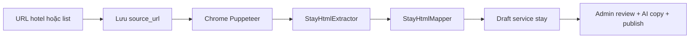

# Lưu trú (Accommodation / cluster `stay`)

Tài liệu hệ thống cho **trang chi tiết chỗ nghỉ** — UI public, admin, AI enrich, và **crawler Booking.com**.

## Kiến trúc

Lưu trú dùng entity **`services`** với `cluster = stay` (không tách bảng riêng):

```
stays_hub (SEO)
  └── service_categories (theo khu vực: Phú Quốc, Đà Nẵng…)
        └── services (cluster stay)
              ├── service_translations
              ├── service_options (hạng phòng)
              ├── attrs JSON (tiện ích, chính sách, nearby…)
              ├── faqs
```

Public URL: `/dich-vu/luu-tru/{category}/{slug}` (route `services.show`, cluster `stay`).

Trang chi tiết **không** dùng `components/service/detail` — dùng **`components/stay/detail`** (gallery + title card, tabs, hộp trắng cùng pattern tour/dịch vụ).

Config: `config/stay.php` · `config/services_catalog.php` (`stays_hub`).

---

## Schema seed (`project/seed_*.php`)

Mở rộng item trong key `services` khi `cluster` = `stay`:

| Field | Mô tả |
|-------|--------|
| `star_rating` | 1–5 (hạng sao khách sạn) |
| `location_label` | Địa chỉ ngắn / khu vực (translation) |
| `attrs.property_type` | `hotel` \| `resort` \| `villa` \| `homestay` \| `apartment` \| `boutique` \| `hostel` \| `bungalow` \| `glamping` \| `camping` \| `floating` \| `cabin` |
| `attrs.address` | Địa chỉ đầy đủ (hiện cạnh vị trí) |
| `attrs.check_in` / `check_out` | Giờ nhận/trả phòng (VD `15:00`) |
| `attrs.amenities` | `string[]` — tiện ích phẳng (fallback nếu không có `amenity_groups`) |
| `attrs.highlight_badges` | `string[]` — pill nổi bật dưới tổng quan (Beachfront, WiFi…) |
| `attrs.amenity_groups` | `{ [groupKey]: string[] }` — **box tiện ích** theo nhóm (`config/stay.php` `amenity_groups`) |
| `attrs.nearby` | `[{ name, distance, icon?, category? }]` — `category`: landmark / beach / nature / transport / dining / shop |
| `attrs.nearby_groups` | `{ [groupKey]: nearby[] }` — nếu crawler đã nhóm sẵn |
| `attrs.review_scores` | `{ staff, facilities, cleanliness, comfort, value, location, wifi }` số 0–10 |
| `attrs.cancellation_policy` | Chính sách huỷ/đổi (text) |
| `attrs.child_policy` / `extra_bed_policy` / `age_restriction` | Trẻ em, giường phụ, tuổi tối thiểu |
| `attrs.pet_policy` / `smoking_policy` | Thú cưng / hút thuốc (property) |
| `attrs.payment_policy` / `payment_cards` | Thanh toán + `string[]` thẻ (Visa, Mastercard…) |
| `attrs.id_required_policy` | Giấy tờ check-in |
| `content` | HTML «Về chỗ nghỉ» (AI được viết) |
| `options[]` | Hạng phòng — xem schema overlay bên dưới |
| `faqs[]` | FAQ đặt phòng |

**Hạng phòng (`options[]`) — overlay khi click:**

| Field | Mô tả |
|-------|--------|
| `code`, `name`, `price_from`, `capacity` | Định danh + giá từ + sức chứa |
| `description` | Mô tả dài (overlay) — AI được viết, không thêm tiện ích bịa |
| `amenities` | `string[]` phẳng (thẻ trên card + fallback nhóm) |
| `attrs.unit_type` | `hotel_room` \| `entire_apartment` \| `entire_villa` \| `entire_place` \| `private_room` \| … (`config/stay.php` `unit_types`) |
| `attrs.size_sqm` | Diện tích m² |
| `attrs.view` | View ngắn (Hướng biển) |
| `attrs.bathroom_count` / `bedroom_count` | Số phòng tắm / ngủ |
| `attrs.smoking` | Hút thuốc **theo hạng phòng** |
| `attrs.bed` / `attrs.beds` | Label ngắn, hoặc bố trí theo phòng: `[{ name, items: [{ type, count, label }] }]` |
| `attrs.highlights` | Badge overlay (Bếp riêng, Hồ bơi riêng, Ban công…) |
| `attrs.amenity_groups` | Box tiện nghi **cấp phòng** (kitchen / bathroom / view / general / …) |
| `attrs.photos` | `[{ url, alt }]` hoặc `string[]` — gallery overlay |
| `attrs.comfort_score` / `comfort_reviews` | “Giường thoải mái, 8.8 – dựa trên 72 đánh giá” |

Key nhóm tiện ích (property + room): `popular`, `bathroom`, `bedroom`, `view`, `kitchen`, `living`, `media`, `outdoor`, `wellness`, `pool_beach`, `dining`, `family`, `accessibility`, `safety`, `parking`, `general`, `business`, `other`. Crawler nên **giữ nguyên label nguồn** trong từng mảng; public chỉ group + hiển thị. Key lạ vẫn hiện (label = key).

**An toàn seed:** `ServiceCatalogSeeder` dùng `updateOrCreate` theo `code` (project-scoped). Hạng phòng upsert theo `service_id` + `code` — không `delete()` toàn bộ options. `StaySeed::complete()` điền content/policies/FAQ mặc định nếu seed thiếu; FAQ riêng trong file seed được giữ và gộp thêm câu hỏi check-in / giá / giấy tờ nếu chưa có.

Chạy lại từng dự án (không `migrate:fresh`). **An toàn trên server** — chỉ catalogue dịch vụ/lưu trú, không đụng bài viết/tour (tránh lỗi slug SEO trùng):

```
php artisan project:seed hicatba --only=services
php artisan project:seed phuquy --only=services
php artisan project:seed phuquoc --only=services
php artisan project:seed culaocham --only=services
php artisan project:seed vitravel --only=services
```

Không dùng `--fresh-project`. `project:seed` đầy đủ (không `--only`) vẫn fail nếu ContentSeeder/TourCategorySeeder trùng slug.

Mỗi profile có chỗ nghỉ demo đầy đủ trong `project/seed_{profile}.php` (Cát Bà 6, Phú Quý 6, Phú Quốc 8, Cù Lao Chàm 7, ViTravel 8).

---

## Public UI (Booking-style)

Component: `resources/views/components/stay/detail.blade.php`

| Section | Nội dung |
|---------|----------|
| Gallery + title card | Ảnh + **card trắng H1** (kicker loại hình, sao, địa chỉ) — cùng pattern tour/dịch vụ |
| Tabs | Tổng quan · Tiện ích · Hạng phòng · Giới thiệu · Vị trí · Chính sách · FAQ |
| Tổng quan | Summary, chip nổi bật, **`.detail-facts`**, điểm hạng mục, quote trong hộp |
| Tiện ích | Box trắng theo nhóm (`.stay-amenity-group`) |
| Hạng phòng | Card trắng + **gallery ảnh nếu `attrs.photos` có URL** + giá → overlay (cùng bộ ảnh) |
| Giới thiệu | `.detail-content` (hộp trắng prose) |
| Vị trí / Chính sách | Nearby + `.detail-facts` (check-in, huỷ, trẻ em…) — **không** bao gồm / không gồm / lưu ý / bảng giá |
| Sidebar | `x-shared.detail-booking-sidebar` |

ViewData: `ViewDataService::attachStayPayload()` — `rooms` (qua `StayFacilities::mapRoom`), `amenityGroups`, `nearbyGroups`, `reviewScores`, `highlightBadges`, `policies`.

---

## Admin

Form: `admin` → **Dịch vụ → Lưu trú → Chi tiết** (`cluster=stay`).

- `StayProductFields`: sao, loại hình, tiện ích, **hạng phòng (overlay JSON)**, chính sách, nearby / amenity_groups / review_scores JSON
- API: `PUT /api/v1/admin/services/{id}` — `attrs` **merge** (không xoá field crawler), `options[]` merge `attrs` phòng
- AI: nút **AI lưu trú** — chỉ viết copy; không được bịa thêm tiện ích / chính sách

---

## AI enrich (3 luồng — form admin)

| Stage | Prompt key | Output |
|-------|------------|--------|
| `meta` | `enrich_stay_meta` | title, summary, location, quote, seo_* |
| `property` | `enrich_stay_property` | content HTML, highlights, attrs, options (**giữ** tiện ích / ảnh / số liệu; **không** inclusions / bảng giá) |
| `faq` | `enrich_stay_faq` | faqs |

API: `POST /api/v1/admin/ai/enrich-stay` · body `{ stage, fields, locale, provider?, instructions? }`

Service: `App\Services\AI\StayEnrichService`

Sync prompt: `php artisan ai:sync-prompts`

**Luồng dữ liệu client:** giống tour/dịch vụ — biến `live` merge sau mỗi stage. `photos` / `amenity_groups` / `beds` trên hạng phòng được **giữ** nếu AI bỏ sót.

---

## Crawler Booking.com (đã triển khai)

Mục tiêu: **Lưu trú → Crawler Booking.com** — chọn danh mục, dán **URL 1 chỗ nghỉ** (test) hoặc **URL listing**, Chrome (Puppeteer) mở trang → **luôn lưu `source_url`** → lọc HTML → **map thủ công `StayHtmlMapper`** (selector từ dump trang chi tiết, không AI) → draft chỗ nghỉ **là trang con của danh mục** (`slug_full` = `{slug_full danh mục}/{slug}`).

AI chỉ dùng sau khi đã có draft: **AI lưu trú** trên form chỗ nghỉ (copy/SEO), không extract schema từ HTML.

Booking.com gần như không trả HTML cho HTTP bot. Crawler mặc định dùng **Chrome headless** (`scripts/stay-crawl/browser.cjs`). Proxy bật trên form admin hoặc `--proxy` (env `STAY_CRAWL_PROXY_*`). HTML dump (Save As) vẫn dùng được khi Chrome/captcha chặn.

Selector map bám dump mẫu `data-html.txt` (trang chi tiết Booking, không commit bắt buộc): title `h2.pp-header__title`, sao `quality-rating`, địa chỉ `PropertyHeaderAddressDesktop`, mô tả `property-description`, tiện ích phổ biến `property-most-popular-facilities-wrapper`, highlights `.property-highlights`, điểm `review_list_score_breakdown`, hạng phòng `rt-name-link` + `rooms_table`, ảnh gallery, check-in/out `#hotelPoliciesInc`. **Gallery modal:** Chrome click gallery → `return-to-grid-button` / `gallery-modal-grid` / `gallery-grid-photo-action-{id}` (ID → `max1024x768/{id}.jpg`, đóng `sub-page--close-button`). **Phòng:** click `rt-name-link` → chờ `rp-content` (`rp-room-title`, `rp-room-size`, `rp-description`, `rp-facilities`, `roomPagePhotos` background-image). **Xung quanh:** `#surroundings_block` / `data-testid="location-block-container"` → `poi-block` + `poi-block-list` (không dùng class hash). **Tiện nghi nhóm:** `data-testid="facility-group-container"` + `facility-group-icon` (nhóm không có `<ul>` vẫn lấy ghi chú trong `h3`, vd. Internet / chỗ đậu xe).



### Admin (một form, hai chế độ)

Trang: **Lưu trú → Crawler Booking.com** (`/services/stay-crawler/`).

Chạy lại URL đã có: API `409 STAY_CRAWL_EXISTS` + modal. **Cải thiện** (`rerun=improve`) bổ sung box thiếu, ghi đè phần crawler có dữ liệu, giữ FAQ/hạng phòng nếu lần này trống. **Xóa sạch** (`rerun=replace`) xóa service + SEO + options + FAQ (forceDelete) rồi cào mới. CLI: `--rerun=improve|replace`.

| Chế độ | URL | Hành vi |
|--------|-----|---------|
| **1 chỗ nghỉ (test)** | `…/hotel/{cc}/{slug}.html` | Job 1 item → fetch → map HTML → import. Dùng để chỉnh selector. |
| **Danh mục / list** | `searchresults…` | Chrome lấy list URL, rồi `process-next` từng item (cùng pipeline). |

Cùng form: danh mục lưu trú, HTML dump tuỳ chọn, proxy. Danh mục chỉ truyền `url` + `max_pages` khi chạy đa.

API: `POST /stay-crawls/from-category` + `POST …/jobs/{id}/process-next`. Map lại: `POST /stay-crawls/items/{id}/map`. Quyền `services.*`.

### Chạy CLI

```
cd scripts/stay-crawl && npm ci

# Một chỗ nghỉ
php artisan stay:crawl ingest "https://www.booking.com/hotel/vn/….html" --project=phuquoc --category=12

# Qua proxy
php artisan stay:crawl ingest "https://www.booking.com/hotel/vn/….html" --project=phuquoc --category=12 --proxy

# Fetch vẫn chặn → Save As HTML:
php artisan stay:crawl ingest --item=3 --file=/tmp/hotel.html --project=phuquoc

# Listing → hàng URL rồi import dưới danh mục
php artisan stay:crawl list "https://www.booking.com/searchresults.html?ss=Phu+Quoc" --project=phuquoc --category=12
php artisan stay:crawl detail --job=1 --project=phuquoc --limit=5
php artisan stay:crawl map --job=1 --project=phuquoc
php artisan stay:crawl import --job=1 --project=phuquoc --category=12
```

`stay:crawl ai` vẫn gọi prompt cũ `crawl_stay_extract` (không dùng trong ingest/admin mặc định).

Test mapper:

```
php artisan test --filter=StayHtmlMapperTest
```

### Code

| Thành phần | Vai trò |
|------------|---------|
| `stay_crawl_sources` / `_jobs` / `_items` | Host, job list, **mỗi URL chỗ nghỉ** + extracted HTML + payload (`ai_json`) + `service_id` |
| `StayHtmlExtractor` | JSON-LD Hotel, Open Graph, section `data-testid`, ảnh bstatic, list `/hotel/{cc}/{slug}.html` |
| `StayHtmlMapper` | Tách schema stay từ HTML (không AI). Payload lưu `ai_json`, status `ai_done` để tương thích importer |
| `StayCrawlFetcher` | Điều phối Chrome (mặc định) / HTTP fallback |
| `StayCrawlBrowser` | Puppeteer `scripts/stay-crawl/browser.cjs` + proxy tuỳ chọn |
| `StayCrawlImporter` | Draft service + options (kèm `attrs.photos`) + FAQ + SEO draft |
| `config/stay.php` `crawl` | UA, timeout, delay, max HTML / rooms / images |

`attrs.crawl` trên service: `{ source_url, canonical_url, source, item_id, job_id, crawled_at }`.

### Ảnh hạng phòng

- Nguồn: `service_options.attrs.photos` = `[{ url, alt }]` hoặc `string[]` URL **thật từ crawl** — không seed ảnh giả.
- Public: `StayFacilities::mapRoom` → gallery trên card **khi có URL** + cùng list trong overlay.
- CDN OTA có thể chặn hotlink (`referrerpolicy=no-referrer`). Nên thay bằng media admin khi publish.

### GIỮ NGUYÊN vs VIẾT LẠI (prompt bắt buộc)

**Giữ nguyên** (không bịa): tên brand, sao, địa chỉ, check-in/out, amenities / amenity_groups (label nguồn), hạng phòng (sức chứa, m², giường, photos URL, smoking), giá từ, nearby, review **scores số**, chính sách nguồn.

**Viết lại** (unique, giọng brand): `summary`, `content` HTML, `highlights` USP (không thêm tiện ích mới), `options[].description`, `faqs`, `seo_*`.

**Không import:** review text OTA, promo bên thứ ba, inventory realtime, inclusions / exclusions / notes / bảng giá chi tiết.

### Payload mapper (`fields`)

Cùng shape public/admin: `title`, `summary`, `content`, `highlights[]`, `star_rating`, `price_from`, `attrs.{amenities, amenity_groups, nearby, review_scores, policies, crawl}`, `options[]` (attrs.photos, beds, amenity_groups), `faqs[]`.

---

## Liên quan

- [02-page-specs.md](02-page-specs.md) — hub dịch vụ
- [14-ai-system-prompts.md](14-ai-system-prompts.md) — prompt enrich + crawl
- [10-admin-console-api.md](10-admin-console-api.md) — API admin
- `project/README.md` — key `services`
