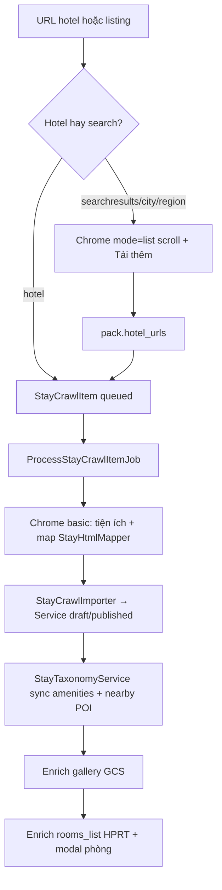
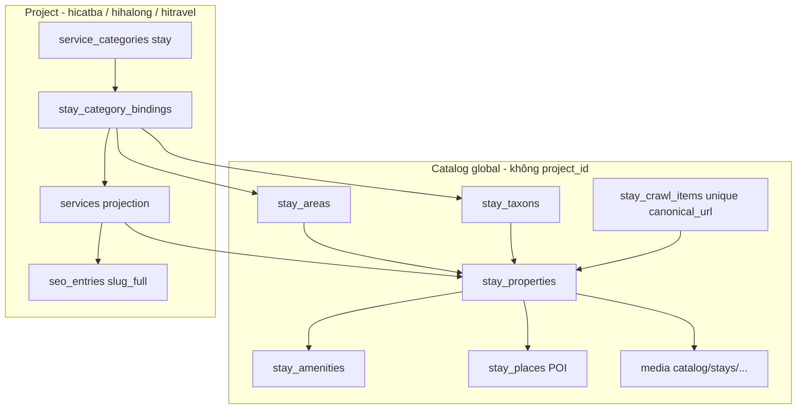
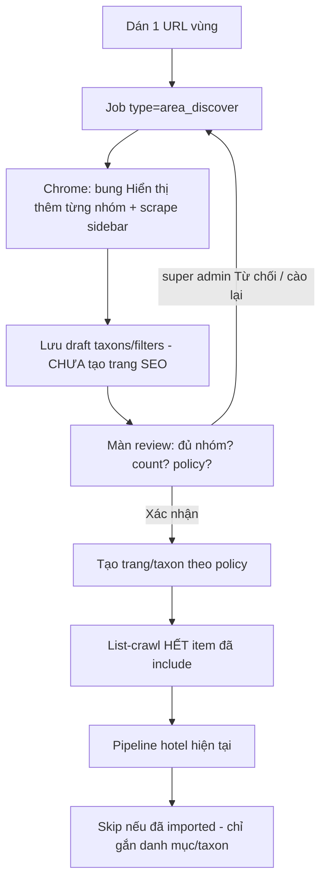

# Stay Catalog Platform — nguồn chỗ nghỉ dùng chung

Tài liệu chuyển đổi crawler lưu trú từ **cào theo từng dự án** sang **catalog API dùng chung** cho các dự án con (`hicatba`, `hihalong`, …) và cổng toàn cầu sau này (`hitravel.net`).

**Phạm vi tài liệu:** phân tích hiện trạng + kiến trúc đích + crawler khu vực + lộ trình phase. **Code P0–P11 đã ship** trên `vitravel.dev` / `admin.vitravel.dev` (2026-09-15). Overlay listing mặc định **tắt** (`STAY_CATALOG_ENABLED=false`) đến khi super admin chạy rebuild R1–R4 trên data thật.

**Vận hành còn lại (không chặn code):** `php artisan migrate` → `stay:catalog-seed-areas` → `stay:catalog-rebuild offline --dry-run` rồi ghi; bật overlay khi sample listing ổn. P12 map engine = docs 17 (coords đã có trên property/service).

**Đọc kèm:**

- [`16-accommodation-stays.md`](16-accommodation-stays.md) — UI/admin/AI + crawler hiện tại
- [`11-multi-project-architecture.md`](11-multi-project-architecture.md) — `project_id` / Host / `X-Project-Code`
- [`17-hotel-map-engine-technical-spec.md`](17-hotel-map-engine-technical-spec.md) — map cần tọa độ + identity nguồn ổn định
- [`gcs-standard.md`](gcs-standard.md) — media theo `projects/{code}/…`
- ADR: [`decisions/ADR-001-stay-catalog-canonical.md`](decisions/ADR-001-stay-catalog-canonical.md)
- Filter Booking: [`decisions/booking-filter-sidebar.md`](decisions/booking-filter-sidebar.md) + dump [`decisions/filter-sidebar-booking.txt`](decisions/filter-sidebar-booking.txt)

---

## 0. Tóm tắt quyết định

| Câu hỏi | Quyết định đề xuất |
|---|---|
| Chỗ nghỉ “thật” sống ở đâu? | **Catalog canonical** (global, không `BelongsToProject`) — một khách sạn Booking = một bản ghi |
| Dự án con hiện gì? | **Projection** (bản chiếu) trên `services` cluster `stay`: SEO/slug/featured/copy riêng, facts/ảnh/phòng lấy từ catalog |
| Danh mục dự án con? | Vẫn tạo `service_categories` như hiện tại, nhưng **bind** vào khu vực geo + (tuỳ chọn) taxon/filter — không cào lại |
| `stay_places` hiện tại? | **Giữ** = tag địa danh lân cận (bãi biển, nhà hàng cạnh KS). **Không** dùng làm khu vực Cát Bà/Hạ Long |
| Khu vực geo mới? | Bảng mới **`stay_areas`** (cây quốc gia → vùng → điểm đến → khu/phường) |
| Crawler chạy trên project nào? | Hub catalog — unique theo URL Booking, không theo `project_id` |
| ~10.000 chỗ nghỉ đã cào? | **Rebuild đa lớp** trước/kèm nâng cấp: offline (identity/geo/alias) → gắn area → list-crawl filter (gắn taxon, skip hotel) → improve Chrome chọn lọc chỗ thiếu |
| Cào filter vs cào danh mục cũ? | **Hai luồng tách.** Discover filter có màn review; **chỉ sau khi super admin xác nhận** mới tạo trang + đẩy list-crawl. Form danh mục stay **không** còn là chỗ cào catalog |
| Menu admin crawler? | **Group riêng** «Catalog chỗ nghỉ» — **chỉ `super_admin`**. Gỡ khỏi menu cụm Lưu trú |
| Trước khi tách catalog? | P1 identity + rebuild offline 10k → P2 area → P3 menu/RBAC → P4 discover+review → P5 confirm+crawl filter → rồi mới P6 entity catalog |

Ví dụ mục tiêu: cào **một lần** vùng Cát Bà + Hạ Long trên hub → `hicatba` bind danh mục “Khách sạn Cát Bà” + “Khách sạn Hạ Long”; `hihalong` bind “Khách sạn Hạ Long” cùng nguồn. Không cào 2 lần, không nhân đôi GCS.

---

## 1. Vấn đề đang gặp

### 1.1 Quy trình vận hành hiện tại

```text
Admin chọn dự án (X-Project-Code)
  → tạo service_category (cluster=stay)     ví dụ “Resort Phú Quốc”, “Homestay Việt Hải”
  → dán URL Booking đã lọc sẵn (link nhỏ)
  → StayCategoryCrawler → POST /stay-crawls/from-category
  → Chrome gom hotel URL → queue từng chỗ nghỉ
  → import thành services thuộc ĐÚNG project đó + gắn đúng 1 danh mục
```

Để có “tag đúng”, operator phải **tự tạo danh mục trước**, rồi dán URL listing đã gắn filter Booking (`nflt`, `ht_id`, district, …). Hệ thống **không đọc filter**, không tự tạo danh mục, không biết chỗ nghỉ thuộc khu vực địa lý nào ngoài cái category vừa chọn.

### 1.2 Hệ quả

| Hiện tượng | Nguyên nhân kỹ thuật |
|---|---|
| Cát Bà cần chỗ nghỉ Hạ Long → phải cào lại trên `hicatba` | `stay_crawl_items` unique `(project_id, canonical_url)`; `services` + media + SEO đều `project_id` |
| `hihalong` không hưởng data `hicatba` đã cào | Global scope `BelongsToProject`; worker `ProcessStayCrawlItemJob` bind project từ job |
| Cùng một KS, 2 bản GCS | Media path `projects/{code}/stays/crawler-*` |
| Tag listing = “danh mục tôi vừa tạo”, không phải geo/loại hình chuẩn | Import chỉ `syncWithoutDetaching` 1 `service_category_id`; `property_type` suy từ title |
| `country_id` chỗ nghỉ crawler = null | Importer không parse/gán địa lý |
| Trùng tiện ích “WiFi / Wi-Fi / Wifi miễn phí” | `StayTaxonomyService` so `LOWER(name)` từng chuỗi, không có alias |
| Trùng POI “Bãi tắm Cát Cò” khác viết | `stay_places` tìm theo name; `lat/lng` không được crawler điền |
| Listing public lọc theo **danh mục project** | `servicesForListing()` `whereHas('categories')` trong scope project |

Seed `hicatba` cố tình **không** catalogue khách sạn/resort đất liền (chỉ “Ngủ trên vịnh”, “Homestay Việt Hải”) — catalogue KS đang sống nhờ crawler, nên nhân đôi càng đau.

---

## 2. Hiện trạng kỹ thuật (đã đọc code)

### 2.1 Entity chỗ nghỉ public

Lưu trú **không** có bảng hotel riêng. Public entity = `services` (`cluster = stay`):

```
stays_hub (SEO)
  └── service_categories          project-scoped, unique (project_id, cluster, slug)
        └── services              project-scoped, FK service_category_id + M2M service_category_service
              ├── translations, options (hạng phòng), attrs JSON, faqs, seo_entries
              ├── stay_amenity_service / stay_amenity_service_option
              └── stay_place_service (POI lân cận + mét)
```

URL public: `/dich-vu/luu-tru/{category}/{slug}` (`ServiceController`, HTML cache theo project).

`countries` / `destinations` cũng **project-scoped** (zone Cát Bà trên `hicatba` ≠ zone Hạ Long trên `hihalong`). Crawler **không** gắn `services.country_id`. Seed đảo dùng `zone_slug` cho tour, không phải cho stay crawl.

### 2.2 Crawler — bảng & ràng buộc

| Bảng | Vai trò | Phạm vi |
|---|---|---|
| `stay_crawl_sources` | Host Booking, delay | unique `(project_id, host)` |
| `stay_crawl_jobs` | 1 URL list hoặc 1 URL hotel + `service_category_id` | `project_id` + category project |
| `stay_crawl_items` | 1 URL chỗ nghỉ, HTML/pack, `ai_json`, `service_id` | **unique `(project_id, canonical_url)`** ← chốt cô lập |

Canonical URL (`StayBookingUrl::canonicalize`) = host + path, **bỏ query** (tracking, checkin). Identity Booking thật sự nằm trong path: `/hotel/{cc}/{slug}.html` — **chưa lưu `cc` / hotel_id thành cột**.

Không có bảng `hotel_sources` / `source_hotel_id` (spec map `17-hotel-map-engine` đã cảnh báo).

### 2.3 Pipeline 1 chỗ nghỉ



Code chính:

| Thành phần | Path |
|---|---|
| API admin | `StayCrawlApiController` — `/api/v1/admin/stay-crawls/*` |
| UI | `admin.vitravel.dev` `StayCategoryCrawler.tsx` (nhúng form danh mục stay) |
| Điều phối | `StayCrawlService` |
| Chrome | `scripts/stay-crawl/browser.cjs` (`basic` / `list` / `gallery` / `rooms_list` / `room`) |
| Map HTML | `StayHtmlMapper` VERSION 9 — **không AI** — identity/geo/completeness |
| Extract | `StayHtmlExtractor` VERSION 2 |
| Import | `StayCrawlImporter` |
| Ảnh | `StayCrawlImageImporter` → GCS `stays/crawler-gallery\|cover\|room` |
| Queue | `ProcessStayCrawlItemJob` queue `crawler`, limiter concurrent Chrome |
| CLI | `stay:crawl`, `stay-crawl:list`, `stay-crawl:work`, `stay-crawl:step` |

Listing Chrome **chỉ** thu `hotel_urls[]` + debug load-more. **Không** scrape sidebar filter, `dest_id`, `nflt`, district, property-type chips.

### 2.4 Import — gắn project & danh mục

`StayCrawlImporter::import()`:

1. Tìm service theo `item.service_id` hoặc `code = bk-{hotelSlug}` **trong project hiện tại**.
2. `uniqueCode()` cũng query `Service::query()` → bị global scope → cùng slug Booking có thể thành `bk-foo` trên project A và `bk-foo` trên project B (hai hàng, hai media).
3. Gán `service_category_id` + `categories()->syncWithoutDetaching`.
4. SEO `parent_id` = SEO danh mục đang cào → `slug_full` = `{danh-mục}/{slug}`.
5. `syncServiceTaxonomies()` từ `attrs`.
6. `HtmlCacheService::clearAll()`.
7. **Không** ghi `country_id`, **không** ghi dest Booking, **không** gắn nhiều danh mục theo loại hình/khu.

`attrs.crawl` trên service: `{ source_url, canonical_url, source, item_id, job_id, crawled_at }`. `attrs.lat` / `lng` có từ mapper (`data-atlas-latlng`) nhưng **không** cột riêng / spatial index (map engine sẽ cần).

### 2.5 Taxonomy hiện có (đừng nhầm tên)

**Tiện ích — gần như global:** `stay_amenities` **không** `project_id`. `findOrCreateAmenity` theo `LOWER(name)` + locale. Group key linh động.

**Địa danh lân cận — nửa nạc nửa mỡ:** `stay_places` có `project_id` nullable + `lat/lng` trống. Lookup **bỏ qua** project (global theo name) rồi create với `project_id` của service — POI dùng chung được một phần, nhưng không có alias, không có toạ độ, không phải “khu vực dự án”.

**Loại hình:** `attrs.property_type` từ `StayHtmlMapper::propertyType()` — keyword trên title + badge (`resort`, `villa`, `khách sạn`, …), mặc định `hotel`. Listing public đã filter `attrs->property_type` (`servicesForListing`).

**Danh mục:** cách “tag” duy nhất cho IA/SEO. Operator = người gắn taxon bằng tay qua URL lọc.

### 2.6 Public listing đã có filter

`ViewDataService::servicesForListing()` lọc SQL: category slug (M2M + FK), `property_type`, giá, sao, amenities. Nền tảng filter **đã có** — thiếu identity geo chuẩn và catalog dùng chung, nên filter chỉ chạy trong 1 project.

### 2.7 Điểm mạnh giữ lại

- Pipeline Chrome tách phiên (basic → gallery → rooms) ổn định trên VPS.
- Mapper thủ công, AI chỉ viết copy (`enrich_stay_*`).
- M2M danh mục đã có (`service_category_service`).
- Amenities relational v2.
- Queue + `StayCrawlLimiter` + unique job theo item.
- Canonical URL + `bk-{slug}` là mầm identity — chỉ đang **sai phạm vi** (theo project).

---

## 3. Lớp khái niệm (tránh đụng tên)

| Tên trong docs này | Không phải | Là |
|---|---|---|
| **Stay Property (catalog)** | `services` hiện tại | Bản ghi chỗ nghỉ canonical, 1 Booking hotel = 1 hàng |
| **Stay Area** | `stay_places` | Cây địa lý: Việt Nam → Quảng Ninh → Hạ Long → Bãi Cháy / Cát Bà / Tuần Châu |
| **Stay Place (POI)** | khu vực dự án | Tag lân cận: “Bãi Cát Cò”, “Bến Bèo”, khoảng cách mét |
| **Stay Taxon** | `service_categories` project | Nhãn catalog từ filter Booking: loại hình, khu phố, beachfront, sao… |
| **Project category** | catalog | `service_categories` cluster stay — trang SEO trên domain con |
| **Projection** | clone crawler | `services` local trỏ `stay_property_id` — URL/SEO/featured của brand |

---

## 4. Kiến trúc đích

### 4.1 Hai lớp dữ liệu



**Catalog** = sự thật vận hành (cào 1 lần, ảnh 1 lần, phòng/tiện ích/POI/geo).  
**Project** = bề mặt brand (danh mục, intro SEO, featured, slug trên domain con, copy AI giọng brand).

### 4.2 Vì sao không chỉ “bỏ project_id trên services”?

- URL/SEO/`slug_full` unique theo `(project_id, language_id, slug_full)`.
- Featured, sort, ẩn hiện khác nhau từng brand.
- HTML cache + `ViewDataService` đang giả định 1 service = 1 trang project.
- `hitravel.net` cần cây thế giới; `hicatba` chỉ cần subset + copy địa phương.

Projection giữ nguyên stack public; catalog giải bài trùng data.

### 4.3 Binding danh mục dự án con

Mỗi `service_category` (cluster stay) có 0..n binding:

```
stay_category_bindings
  service_category_id     -- danh mục local
  stay_area_id            -- bắt buộc: Cát Bà / Hạ Long / …
  stay_taxon_id           -- optional: hotel | resort | beachfront | district-x
  include_child_areas     -- true: lấy cả phường/đảo con
  extra_area_ids[]        -- hicatba thêm Hạ Long vào cùng hoặc danh mục riêng
  sync_mode               -- auto | manual
  last_synced_at
```

**Hành vi listing:** chỗ nghỉ hiện trên danh mục = projection thuộc category **hoặc** (nếu sync auto) mọi property thỏa area+taxon, materialize thành projection nếu chưa có.

**Hành vi chi tiết:** trang con vẫn `/dich-vu/luu-tru/{cat}/{slug}` trên domain project. Facts (gallery, phòng, amenities) đọc catalog; title/SEO/content overlay local nếu có, fallback catalog.

`hicatba` ví dụ:

| Danh mục local | Bind |
|---|---|
| Khách sạn Cát Bà | area=`cat-ba` + taxon=`hotel` |
| Resort Cát Bà | area=`cat-ba` + taxon=`resort` |
| Khách sạn Hạ Long | area=`ha-long` + taxon=`hotel` |
| Homestay Việt Hải | area=`viet-hai` (child of Cát Bà) |

Cùng property “KS Bãi Cháy” chiếu sang `hihalong` và `hicatba` nếu cả hai bind area Hạ Long.

### 4.4 Hai luồng crawler (tách bắt buộc)

| | **A. Cào danh mục cũ** | **B. Cào filter khu vực (catalog)** |
|---|---|---|
| Vào từ | Trước đây: form `service_categories` + `StayCategoryCrawler` / `/services/stay-crawler/` | Group menu **Catalog chỗ nghỉ** (mới) |
| Input | URL list/hotel đã lọc tay + category local | 1 URL vùng (`searchresults` / `city` / `region`) |
| Tạo trang | Category **đã có** trước khi cào | **Chưa** tạo trang lúc discover |
| Gate | Không | **Super admin review** filter đã bung «Hiển thị thêm» chưa, policy lấy/bỏ đúng chưa → mới tạo trang + spawn list |
| Trùng hotel | Unique theo project | Unique global; list-crawl chủ yếu **gắn taxon/danh mục** |

Luồng A giữ tương thích ngắn hạn rồi **ẩn khỏi menu Lưu trú**. Biên tập viên dự án chỉ **bind** danh mục local → catalog. Mọi cào catalog = luồng B, quyền cao nhất.



Chi tiết DOM/policy nhóm: [`decisions/booking-filter-sidebar.md`](decisions/booking-filter-sidebar.md).

### 4.5 API dùng chung (nội bộ trước, public sau)

Nội bộ (cùng Laravel, bỏ project scope khi đọc catalog):

| Endpoint (đề xuất) | Việc |
|---|---|
| `GET /api/v1/catalog/stays` | Lọc area, taxon, type, sao, amenities, bbox |
| `GET /api/v1/catalog/stays/{id}` | Payload đầy đủ (rooms, media, taxonomies) |
| `GET /api/v1/catalog/areas?q=` | Cây/area search |
| `POST /api/v1/admin/catalog/discover` | Tạo job discover (không spawn list) |
| `POST /api/v1/admin/catalog/discover/{id}/confirm` | Sau review: tạo trang + spawn list |
| `POST /api/v1/admin/catalog/rebuild` | R1–R4 tái xây data cũ |
| `POST /api/v1/admin/service-categories/{id}/bind-area` | Gắn danh mục con |
| `POST /api/v1/admin/service-categories/{id}/bind-area` | Gắn danh mục con |
| `POST /api/v1/admin/service-categories/{id}/sync-projections` | Materialize/cập nhật services |

Sau này `hitravel.net`: cùng catalog, listing theo country/area toàn cầu; map engine đọc `lat/lng` catalog (docs 17).

Auth: quyền platform `stays.catalog.*`; dự án con chỉ bind + overlay, **không** enqueue crawl trùng URL đã imported trừ `rerun=improve`.

---

## 5. Nâng cấp map / tag — làm trước khi tách catalog

Đây là bước **tối ưu dữ liệu nguồn**. Làm trên crawler + importer hiện tại vẫn có ích; catalog chỉ việc kế thừa.

### 5.1 Identity chỗ nghỉ (bắt buộc)

Từ URL `/hotel/{cc}/{slug}.html`:

| Field | Nguồn | Dùng để |
|---|---|---|
| `source` | `booking.com` | Đa nguồn sau này |
| `source_hotel_key` | `{cc}:{slug}` | Unique catalog |
| `canonical_url` | path không query | Replay crawl |
| `booking_cc` | `vn`, `th`, … | Gắn country |
| `booking_dest_id` / `dest_type` | query listing hoặc JSON-LD / data layer trang detail | Gắn area |
| `lat` `lng` | `data-atlas-latlng` (đã có trong attrs) | Area fallback + map |

Quy tắc merge: unique `(source, source_hotel_key)` toàn platform. Re-crawl = improve cùng property, không insert mới.

**Việc ngay (Phase 1):** cột trên `stay_crawl_items` + `attrs.crawl`; backfill từ `canonical_url`; unique logic `queueHotelUrl` chuyển dần sang key này (vẫn giữ unique cũ trong transision).

### 5.2 Parse địa chỉ → area (không chỉ 3 đoạn cuối)

Hiện `shortLocation()` cắt 3 phần address, hardcode “Phú Quốc”.

Cần pipeline:

1. Tách address Booking: số nhà, đường, phường, huyện, tỉnh, quốc gia.
2. Map `booking_cc` → `countries.code` (bảng country **catalog** hoặc lookup không scope).
3. Match `stay_areas` theo thứ tự: dest_id Booking → slug/alias → geo chứa điểm (`lat/lng` trong bbox/polygon) → fuzzy name.
4. Gắn **primary area** (nơi KS đứng) + **parent areas** (Cát Bà ∈ Hải Phòng/Quảng Ninh tuỳ cây đã chốt).
5. Nearby POI: `findOrCreatePlace` thêm alias table; điền lat/lng khi Booking có; merge “Cat Co 1” / “Cát Cò 1”.

Cây area đề xuất (Việt Nam, phục vụ overlap Cát Bà–Hạ Long):

```
VN
 ├── hai-phong
 │    └── cat-ba
 │         ├── thi-tran-cat-ba
 │         ├── viet-hai
 │         └── lan-ha
 └── quang-ninh
      └── ha-long
           ├── bai-chay
           ├── hon-gai
           └── tuan-chau
```

Admin có thể gắn **area liên quan** (related): Cát Bà ↔ Hạ Long để gợi ý bind, không tự trộn listing trừ khi category bind cả hai.

### 5.3 Property type — không chỉ title

Thứ tự tin cậy:

1. Filter listing đã spawn crawl (`ht_id` / taxon) — tín hiệu mạnh nếu URL có `nflt`.
2. JSON-LD `@type` / badge Booking trên trang detail (mở selector, không đoán).
3. Keyword title/badge hiện tại.
4. Fallback `hotel`.

Lưu `property_types[]` (một resort beachfront vừa `resort` vừa `beachfront` taxon), giữ `property_type` primary cho filter cũ.

### 5.4 Amenity alias & chuẩn hoá

Bảng `stay_amenity_aliases` (`alias` unique, `stay_amenity_id`). Seed từ `config/stay.php` `amenity_icons` + danh sách WiFi/pool/beachfront đa ngôn ngữ.

`findOrCreateAmenity`: normalize (lowercase, bỏ dấu tuỳ locale, collapse khoảng trắng) → alias → name. Không tạo tag mới nếu alias đã trỏ master.

Group key: giữ linh động; thêm map `group_key` Booking heading → key `config/stay.php` (đã có `groupKeyFromHeading`).

### 5.5 Gắn taxon lúc import (thay vì 1 category)

Khi crawl từ URL filter, job mang `taxon_ids[]` / `nflt` đã parse. Import:

- Gắn property ↔ taxons (M2M).
- **Không** bắt buộc tạo `service_categories` project.
- Nếu job vẫn có `service_category_id` (luồng cũ): giữ sync như hiện tại (tương thích).

Sau binding: projection inherit taxon → có thể hiện trên nhiều danh mục con (M2M đã có).

### 5.6 Tag “hỗ trợ chéo” khu vực

Ngoài primary area:

- **Radius rule (tuỳ chọn):** KS Hạ Long trong bán kính N km từ centroid Cát Bà → flag `nearby_area=cat-ba` (không đổi primary).
- **Manual related areas** trên `stay_areas`.
- Listing dự án con: bind `extra_area_ids` hoặc bật “bao gồm khu liên quan”.

Mặc định **không** auto-nhét mọi KS Hạ Long vào listing Cát Bà — chỉ khi category bind rõ.

### 5.7 Chất lượng tag — điểm completeness

Trên property/item:

```
completeness: { identity, geo, type, amenities, poi, gallery, rooms, rates }
```

Worker/admin lọc “thiếu geo / thiếu type” để improve `--from=basic` hàng loạt theo area. Phục vụ Phase migrate: không chuyển property rác sang catalog.

---

## 6. Crawler khu vực — chi tiết vận hành

### 6.1 Input

Một URL vùng, ví dụ:

- `https://www.booking.com/searchresults.vi.html?ss=Cát+Bà&dest_id=-3712045&dest_type=city`
- `https://www.booking.com/region/vn/ha-long-bay.html`
- `https://www.booking.com/city/vn/ha-long.html`

`StayBookingUrl::isSearchPage()` đã nhận `searchresults` / `city` / `region` / `district` / `landmark`.

### 6.2 Chrome mode mới: `list_discover` (không thay `list`)

Thu thập (pack JSON, PHP không parse DOM filter):

```json
{
  "dest": { "ss": "Cát Bà", "dest_id": "-3712045", "dest_type": "city", "label": "Cát Bà, Việt Nam" },
  "filters": [
    {
      "group": "property_type",
      "key": "ht_id",
      "items": [
        { "id": "204", "label": "Khách sạn", "count": 86, "url": "…&nflt=ht_id%3D204" },
        { "id": "206", "label": "Resort", "count": 12, "url": "…" }
      ]
    },
    {
      "group": "neighborhood",
      "key": "di",
      "items": [{ "id": "…", "label": "Thị trấn Cát Bà", "count": 40, "url": "…" }]
    },
    {
      "group": "popular",
      "key": "popular_nearby|hotelfacility|…",
      "items": [{ "id": "…", "label": "Bãi biển riêng", "count": 9, "url": "…" }]
    },
    { "group": "stars", "key": "class", "items": [] },
    { "group": "review_score", "key": "review_score", "items": [] }
  ],
  "hotel_urls": ["…"]
}
```

Nhóm filter Booking đổi class hash — **bám `data-testid` / `data-filters-group` / `input[name]`, không class CSS.** URL item = URL hiện tại + `nflt`.

**Bắt buộc** click «Hiển thị thêm» từng nhóm trước khi scrape (dump mẫu gần như chưa bung). Chi tiết + policy lấy/bỏ: [`booking-filter-sidebar.md`](decisions/booking-filter-sidebar.md).

Timeout discover: đủ dest + **toàn bộ filter sau expand**. Không load-more hết hotel ở bước này.

### 6.3 Discover ≠ tạo trang ≠ list-crawl

Ba bước **cấm gộp một API**:

1. **Discover** — Chrome + lưu `stay_crawl_jobs.type=area_discover` + JSON filters (draft). Status `review`. Không `enqueueList`. Không `service_categories`.
2. **Review (màn hình)** — super admin kiểm: số nhóm, số item sau expand, dest_id, policy. Có thể «Cào lại filter», ẩn item, đổi create_page/crawl từng dòng. Nhóm `unknown` mặc định không crawl.
3. **Confirm** — `POST .../discover/{id}/confirm` mới:
   - upsert taxon + **tạo trang** (hub catalog) cho item `create_page=true`;
   - spawn `enqueueList` cho **mọi** item `crawl=true` (mặc định = hết nhóm include, không chỉ 2–3 loại hình).

Tên trang: `{label} {area}` → «Resort Phú Quốc». Slug `resort-phu-quoc`.

Job.meta list: `{ parent_discover_id, area_id, taxon_id, nflt }`.

### 6.4 Trùng hotel = làm giàu danh mục

Một resort beachfront nằm ở URL Resort **và** Beachfront **và** khu Dương Đông. `queueHotelUrl` identity global:

- Đã `imported` → `linkItemToJob` + gắn taxon/category; **không** Chrome hotel (trừ improve).
- Đang queued → gắn thêm taxon, một pipeline.

List-crawl hết filter include trên vùng đã có ~10k KS = **gắn tag**, không nhân bản trang. Đó là lý do confirm phải đẩy **hết** item include, không cherry-pick 3 loại.

### 6.5 Chrome discover: bung filter

Không scrape DOM lần đầu. Xem [`booking-filter-sidebar.md`](decisions/booking-filter-sidebar.md) §2. Pack bắt buộc `debug.expand[]`. Màn review cảnh báo nhóm `clicks=0` mà legend thường có «thêm» (ht_id, di, hotelfacility).

Bám `data-testid="filters-sidebar"`, `data-filters-group`, `data-filters-item`, `input[name]`. Dump Phú Quốc chỉ là fixture.

### 6.6 Policy nhóm (tóm tắt)

Chi tiết bảng: docs filter sidebar §4.

- **SEO + crawl:** `ht_id`, `di`, `stay_type` (nếu không trùng), `popular_nearby_landmarks` (ngưỡng count), `ht_beach`.
- **Crawl gắn taxon, ít/không trang:** `hotelfacility` (trang chỉ allowlist), `class`, `popular_activities`.
- **Bỏ:** `price`, `distance`, `used_filters`, `popular` (trùng), `mealplan`, `roomfacility`, `tdb`, `unit_config_grouped`, `review_score`, `rated_high`; `chaincode` / a11y / sustainable mặc định tắt, tick tay trên review.

### 6.7 Tái xây ~10.000 chỗ nghỉ đã cào

Không chờ catalog entity xong mới đụng data cũ. Ba lớp, có màn **Catalog → Tái xây**:

| Lớp | Chrome hotel? | Việc | Khi |
|---|---|---|---|
| **R1 Offline** | Không | `source_hotel_key`, alias amenity/POI, parse `attrs.geo`, completeness | P1 — chạy hết ~10k, dry-run CSV |
| **R2 Gán area** | Không | Resolver address/dest/lat → `stay_area` | P2 — unmatched vào hàng «cần sửa tay» |
| **R3 Filter enrich** | Chỉ listing | Mỗi area: discover → review → confirm → list-crawl hết include; skip hotel imported | P5 — làm dày taxon/danh mục |
| **R4 Improve chọn lọc** | Có, theo hàng | `rerun=improve` chỗ completeness thấp (thiếu geo, amenity_groups, gallery) | Sau R1; limiter; nhiều ngày |

Ưu tiên R4: thiếu `lat/lng` → `from=basic`; thiếu gallery → `from=gallery`; đủ facts thì **không** mở lại 10k session.

Command/API: `stay:catalog-rebuild {offline\|areas\|improve}` + `--dry-run --limit --project=*`. UI: progress, resume, lỗi, CSV unmatched. Không `migrate:fresh`.

### 6.8 Admin — group menu riêng (chỉ siêu quản trị)

Hiện crawler nằm group Lưu trú: `nav.ts` item «Crawler Booking» → `/services/stay-crawler/`; form danh mục nhúng `StayCategoryCrawler`; quyền `services.create` / `services.view` (`admin_permissions.php`).

**Đích:** gỡ khỏi cụm stay. Group mới, path `/catalog/…`, **chỉ** `users.role` ∈ `{admin, super_admin}` (`is_super_admin`) — cùng cửa như `/settings/users`. Staff/owner project **không** thấy group, **không** gọi API catalog crawl (403). Permission key `stays.catalog.*` **và** gate role (permission riêng không đủ nếu gán nhầm cho editor).

| Path | Màn | Việc |
|---|---|---|
| `/catalog/` | Tổng quan | Số property/item, completeness, job chạy, unmatched area |
| `/catalog/areas/` | Cây khu vực | CRUD `stay_areas`, dest_id, related |
| `/catalog/discover/` | Cào filter | Dán URL vùng → job discover |
| `/catalog/discover/{id}/` | **Review filter** | Bảng nhóm/item/count/expand/policy; cào lại; **Xác nhận tạo trang + cào** |
| `/catalog/jobs/` | Hàng list/hotel | Monitor pipeline cũ (dời UI stay-crawler) |
| `/catalog/properties/` | Kho chỗ nghỉ | Canonical (sau P6); trước đó list services stay cross-project |
| `/catalog/rebuild/` | Tái xây 10k | R1–R4: dry-run, chạy, log |
| `/catalog/taxons/` | Taxon | Ẩn/sửa nhãn, allowlist facility |
| `/catalog/bindings/` | Bind dự án | Overview category local ↔ area (sau P9) |

Form danh mục stay (editor): **bỏ crawler URL**. Thay block **Nguồn catalog** (bind). Redirect `/services/stay-crawler/*` → `/catalog/jobs/` nếu super admin, 404 nếu không.

API discover/confirm/rebuild: prefix `/api/v1/admin/catalog/…`, không nhồi vào `from-category`. `from-category` deprecate: 410 hoặc chỉ super admin + warning.

---

## 7. Schema đề xuất (mới + đổi)

Không implement ở phase docs. Đây là hợp đồng để phase sau migration.

### 7.1 Catalog

```
stay_areas
  id, parent_id, slug, level (country|region|destination|zone),
  country_code, booking_dest_id, booking_dest_type,
  lat, lng, bbox JSON, radius_meters,
  related (pivot stay_area_related)

stay_area_translations (name, slug, intro)

stay_taxons
  id, group (property_type|neighborhood|facility|popular),
  code (ht_id:204), stay_area_id nullable,
  filter_url, source (booking), sort, is_active

stay_taxon_translations

stay_properties
  id, source, source_hotel_key UNIQUE,
  booking_cc, canonical_url, source_url,
  primary_stay_area_id, country_code,
  property_type, star_rating, rating, review_count,
  lat, lng, price_from, currency, status,
  completeness JSON, last_crawled_at, attrs JSON

stay_property_translations (title, location_label, content, …)

stay_property_area (property_id, area_id, role primary|parent|nearby)
stay_property_taxon (property_id, taxon_id)

stay_property_options   -- hoặc tái dùng service_options khi projection materialize
```

Amenities/POI: chuyển pivot từ `service_id` sang `stay_property_id` (giữ bảng tag). `stay_places.project_id` bỏ dần.

Crawl:

```
stay_crawl_items: thêm source_hotel_key, stay_property_id;
  unique mới (source, source_hotel_key) hoặc canonical_url KHÔNG kèm project_id
stay_crawl_jobs: type listing|hotel|area_discover; stay_area_id; project_id nullable (hub)
```

Media: path `catalog/stays/{property_id}/gallery|cover|room/...` — **không** `projects/{code}`. Projection gắn cùng `media_id` (cross-project read) hoặc copy attachment row, không upload lại.

### 7.2 Project

```
services.stay_property_id nullable
  -- cluster stay: bắt buộc sau migrate; cluster khác null

stay_category_bindings (mục 4.3)

seo_entries vẫn project-scoped trên projection
```

Overlay copy: nếu `service_translations.content` trống → đọc property translation. AI enrich trên **projection** (giọng brand), không ghi đè catalog facts.

### 7.3 Country catalog vs country project

`countries` đang per-project (tour IA). **Không** gộp lung tung với tour.

Stay dùng `stay_areas.country_code` (`VN`) độc lập. Map sang `countries` project chỉ khi cần hiện cờ/tour liên quan — bảng map `project_country_stay_area` nếu cần, không chặn catalog.

---

## 8. Luồng tương lai (end-to-end)

### 8.1 Lần đầu / làm giàu vùng (hub catalog)

1. Super admin **Catalog → Cào filter**, dán searchresults (vd. Cát Bà).
2. Discover: Chrome bung «Hiển thị thêm», lưu draft filters. **Chưa** tạo danh mục.
3. Màn review: đủ nhóm `ht_id`/`di`/…, expand log OK, policy đúng → **Xác nhận**.
4. Hệ tạo trang taxon include + spawn list-crawl **hết** item crawl=true.
5. Hotel mới → pipeline đầy đủ. Hotel đã có (~10k) → skip Chrome hotel, chỉ gắn danh mục/taxon.
6. Gallery/rooms chỉ với item mới hoặc hàng R4 improve.

### 8.2 Dự án hicatba

1. Tạo (hoặc seed) danh mục “Khách sạn Cát Bà”.
2. Bind area=`cat-ba` taxon=`hotel`, sync auto.
3. Sync projections: tạo `services` + SEO dưới danh mục, `stay_property_id` trỏ catalog, media_id dùng chung.
4. Tạo danh mục “Khách sạn Hạ Long”, bind `ha-long` (data đã cào từ job vùng Hạ Long — không cào lại).
5. Crawler trên form danh mục con: ẩn hoặc “chỉ improve overlay”.

### 8.3 Cập nhật giá / ảnh

Re-crawl improve trên **catalog item**. Mọi projection nhận facts mới; content AI local không bị xoá (`strategy=improve` đã có sẵn).

### 8.4 hitravel.net

Project `hitravel`: bind area theo quốc gia/thành phố, hoặc listing catalog trực tiếp không materialize (phase sau). Cùng API `GET /catalog/stays?area=ha-long`.

---

## 9. Migration + tái xây dữ liệu đang có (~10.000 chỗ nghỉ)

Không `migrate:fresh`. Coi **kho hiện tại là nguồn** phải nâng cấp khớp catalog, không phải bỏ.

### 9.1 Thứ tự an toàn

1. **R1 Offline** (P1): backfill `source_hotel_key` từ `canonical_url` / `attrs.crawl` / `code` `bk-*`; alias amenity/POI; parse geo; completeness. Dry-run bắt buộc.
2. **R2 Area** (P2): gán `stay_area`; CSV unmatched (sửa dest/alias, không cào 10k).
3. Unique crawl / catalog entity (P6) + **nhóm trùng key xuyên project** → master + projection (giữ slug URL public).
4. **R3 Filter enrich** (P5): từng area có KS — discover → review → confirm list-crawl include. Skip hotel imported.
5. Media: chưa move GCS; master media_id dùng chung khi đọc.
6. Binding area **song song** category cũ; flag `stay.catalog.listing` per project.
7. **R4 Improve** chọn lọc completeness thấp — không improve hàng loạt 10k.

Cờ `STAY_CATALOG_ENABLED=false` mặc định. Rollback: tắt flag; projection vẫn là `services` hợp lệ.

### 9.2 Màn Tái xây (super admin)

- Thống kê: tổng stay, có key, có geo, có area, completeness trung bình, số unmatched.
- Nút R1/R2/R4 + dry-run + limit + resume job.
- R3 = deep-link tạo/mở discover theo area (URL Booking lưu trên area khi discover lần đầu).
- Log: `skipped_existing`, `taxon_attached`, `unmatched_area`, `improve_queued`.

---

## 10. Tương thích crawler cũ

| Luồng | Sau chuyển đổi |
|---|---|
| Form danh mục + URL hotel/list | Vẫn chạy; ghi catalog nếu flag on, đồng thời projection vào category đó |
| `rerun=improve\|replace` | Improve catalog; replace chỉ khi quyền platform (xoá property ảnh hưởng nhiều project — confirm + impact) |
| CLI `--project --category` | Project = nơi tạo projection; crawl identity global |
| Unique 409 `STAY_CRAWL_EXISTS` | Đổi nghĩa: “đã có trên catalog” + gợi ý bind/improve, không cào mới |

`ServicePurgeService`: xoá projection ≠ xoá catalog. Xoá catalog = gỡ mọi projection (impact UI bắt buộc).

---

## 11. Bảo mật, pháp lý, vận hành

- Giữ lịch sự: delay, limiter, proxy residential VPS — discover thêm 1 phiên Chrome/region, không nhân Chrome theo số filter cùng lúc (spawn list tuần tự hoặc max N job list).
- Không lưu `raw_html` lâu trên catalog (item crawl có thể purge HTML sau import).
- Robots/ToS Booking: giữ mục nghiên cứu/import nội bộ như docs 16; không biến API public thành proxy Booking live inventory.
- Rate table vẫn snapshot ngày crawl cố định — không quảng cáo giá live.
- Quyền: crawler catalog **chỉ super_admin** + `stays.catalog.*`. `services.create` không đủ.

---

## 12. Việc nên làm thêm (ngoài mô tả gốc)

Có lợi, nên đưa vào roadmap nếu không đội phase crit:

1. **Completeness score + queue “thiếu geo/type”** — chất lượng catalog.
2. **Merge UI** hai property (sai slug Booking / đổi tên) — bắt buộc khi live.
3. **Cột lat/lng + index** trên property (chuẩn bị map engine 17, tránh đọc JSON).
4. **Alias POI/amenity** đa ngôn ngữ (vi/en) — hitravel.
5. **Không nhân Chrome** khi hotel đã imported — chỉ attach taxon (mục 6.4).
6. **Đề xuất bind** cho project theo `related_areas` (Cát Bà gợi ý Hạ Long).
7. **Purge HTML thô** sau N ngày — giảm DB.
8. **Observability:** metric job discover, số taxon spawn, % item skip-as-exists, % thiếu coords.
9. **Seed zones stay** cho `hicatba`/`hihalong` (cây area) độc lập seed tour.
10. **Virtual listing** (không materialize) cho hub vitravel nếu không cần SEO từng KS trên domain hub — phase muộn.

Không làm trong phase đầu: checkout Booking, giá realtime, nguồn Airbnb/Agoda (chỉ để chỗ `source` trên identity).

---

## 13. Lộ trình phase — giao việc

Ước lượng = phiên agent/dev đã quen repo, chưa gồm chờ duyệt product. Mỗi phase **đóng được** với AC dưới đây trước khi mở phase sau.

### Phase 0 — Chốt spec (docs) — **xong**

**Owner:** kiến trúc + product  
**AC:**

- [x] Docs 18 + ADR-001
- [x] Tách luồng filter (màn review, confirm mới tạo trang) vs crawler danh mục cũ
- [x] Group menu Catalog chỉ super_admin
- [x] Chính sách nhóm filter + dump Phú Quốc (`booking-filter-sidebar.md`)
- [x] Rebuild R1–R4 cho ~10k chỗ nghỉ cũ
- [x] Cây area mặc định: Cát Bà ⊂ Hải Phòng, Hạ Long ⊂ Quảng Ninh; hicatba **bind tay** (không auto listing Hạ Long)
- [x] Materialize projection (P6) — khuyến nghị đã làm

**Không code mới khi chỉnh spec.** Code nằm các phase sau.

---

### Phase 1 — Identity, alias, rebuild offline ~10k

**Mục tiêu:** crawler mới + toàn bộ chỗ nghỉ đã cào có key/geo/alias; chưa tách catalog.  
**Phụ thuộc:** Phase 0.  
**Files gợi ý:** `StayBookingUrl`, `StayHtmlMapper`, `StayCrawlImporter`, `StayTaxonomyService`, `StayCrawlItem`, `config/stay.php`, command rebuild, tests.

| ID | Việc | AC |
|---|---|---|
| 1.1 | Parse `booking_cc` + `source_hotel_key`; lưu item + `attrs.crawl` | **Xong** — ingest mới có key `vn:slug` |
| 1.2 | **R1** backfill key mọi item/service stay (~10k) | Command `stay:catalog-rebuild offline` (dry-run CSV) |
| 1.3 | Amenity alias + normalize | `StayText::foldAmenity` — “Wi-Fi” / “Wifi miễn phí” cùng normalized |
| 1.4 | Place alias POI | `StayText::fold` — “Cát Cò 1” / “Cat Co 1” |
| 1.5 | `propertyType` JSON-LD/badge; `property_types[]` | Mapper VERSION 9 |
| 1.6 | Parse address → `attrs.geo` | `StayGeoParser` — không hardcode Phú Quốc |
| 1.7 | `lat/lng` ổn định trên service/item | Cột + attrs |
| 1.8 | Completeness JSON | `StayCompleteness` |
| 1.9 | **R1** merge alias trên 10k (không Chrome) | Cùng command offline |
| 1.10 | `/catalog/rebuild/` + `stay:catalog-rebuild offline` | Super admin; staff 403 |

**Done khi:** ~10k có identity; crawl mới không tạo tag rác.  
**Rủi ro:** selector JSON-LD Booking đổi — giữ fallback keyword.  
**Verify:** dry-run + sample 50 hàng; `php artisan test --filter=Stay`.

---

### Phase 2 — `stay_areas` + gán area cho data cũ

**Mục tiêu:** cây geo global; chỗ nghỉ mới và ~10k cũ có primary area.  
**Phụ thuộc:** 1.1, 1.6, 1.7.

| ID | Việc | AC |
|---|---|---|
| 2.1 | Migration `stay_areas` + translations + related pivot | Seed VN + Cát Bà + Hạ Long + zone |
| 2.2 | CRUD area `/catalog/areas/` | Chỉ super_admin |
| 2.3 | `StayAreaResolver`: dest_id → alias → bbox | Unit test địa chỉ Cát Bà → `cat-ba` |
| 2.4 | Importer ghi area | Service mới có area |
| 2.5 | **R2** gán area hàng loạt 10k | `stay:catalog-rebuild areas` |

**Done khi:** Cát Bà vs Hạ Long tách bằng area id, không bằng tên danh mục.  
**Rủi ro:** dest_id Booking trùng/âm — bảng map thủ công.

---

### Phase 3 — Group menu Catalog + RBAC siêu quản trị

**Có thể song song P1/P2.** Chưa làm crawler filter.

| ID | Việc | AC |
|---|---|---|
| 3.1 | Nav group «Catalog chỗ nghỉ» `/catalog/*` | Chỉ `is_super_admin`; staff 404-style |
| 3.2 | Gỡ crawler khỏi menu Lưu trú | Form category = `StayCategoryBind` |
| 3.3 | Redirect `/services/stay-crawler` → `/catalog/jobs` | Client redirect + SuperAdminOnly |
| 3.4 | Permission `stays.catalog.*` + gate role | `from-category` 410 trừ super_admin |
| 3.5 | UI jobs tại `/catalog/jobs/` | Re-export stay-crawler pages |

**Done khi:** biên tập viên không thấy/cào catalog; super admin vào group mới.

---

### Phase 4 — Discover filter + màn review (chưa tạo trang, chưa list-crawl)

**Phụ thuộc:** P2 area, P3 menu. **Cấm** spawn list trong API discover.

| ID | Việc | AC |
|---|---|---|
| 4.1 | `browser.cjs` `list_discover`: expand từng nhóm rồi scrape | Pack.filters + `debug.expand`; click theo text «Hiển thị thêm» |
| 4.2 | Parser PHP: policy `booking-filter-sidebar.md`; group lạ = `unknown` | Không hardcode class hash |
| 4.3 | `POST /api/v1/admin/catalog/discover` → job `review` | 0 `enqueueList`; 0 category mới |
| 4.4 | Màn `/catalog/discover/review/?id=` | Tick create_page & crawl; cảnh báo chưa bung |
| 4.5 | Nút «Cào lại filter» | Giữ tick/ghi chú review |
| 4.6 | Test dump Phú Quốc + fixture nhỏ | `price` ignore; `ht_id` seo_and_crawl |

**Done khi:** dán URL vùng → xem đủ filter trên màn, **chưa** trang SEO mới, **chưa** job list.  
**Rủi ro:** DOM Booking; copy nút expand đa ngữ.

---

### Phase 5 — Confirm: tạo trang + list-crawl hết filter include (+ R3 làm giàu 10k)

**Phụ thuộc:** P4. Skip-duplicate dựa P1 identity.

| ID | Việc | AC |
|---|---|---|
| 5.1 | `POST .../discover/{id}/confirm` | Chỉ job `review`; tạo trang `create_page`; enqueue list `crawl` |
| 5.2 | Mặc định tick **hết** nhóm include | Super admin bỏ tick trước confirm |
| 5.3 | Skip Chrome hotel nếu `source_hotel_key` đã imported | Log `skipped_existing` + `taxon_attached` (lưu job meta) |
| 5.4 | Parent discover theo dõi % list con | `child_progress` trên API + màn review |
| 5.5 | **R3** `/catalog/rebuild` không tự confirm | Operator: discover → review → confirm từng area |
| 5.6 | Nhóm `popular` không spawn (trùng) | Policy IGNORE |

**Done khi:** 1 confirm tạo đúng trang loại hình+khu; KS cũ vào nhiều danh mục; số phiên Chrome **hotel** ≈ KS **mới**, không ≈ số filter × 10k.  
**Verify:** unique key vs Chrome hotel sessions.

---

### Phase 6 — Tách `stay_properties` (catalog)

**Mục tiêu:** entity canonical; crawler ghi catalog trước, projection sau.  
**Phụ thuộc:** P1 identity, P2 area, P5.3 skip duplicate.

| ID | Việc | AC |
|---|---|---|
| 6.1 | Migration property + pivots area/taxon + `services.stay_property_id` | Unique `source_hotel_key` |
| 6.2 | Importer: upsert property rồi service projection | 2 project ingest cùng URL → 1 property |
| 6.3 | Media path `catalog/stays/{id}/` | `MediaService` bỏ prefix project nếu folder `catalog/` |
| 6.4 | Unique crawl lookup global theo key | `queueHotelUrl` skip Chrome nếu imported |
| 6.5 | Purge: không xoá media catalog nếu còn projection khác | |
| 6.6 | Flag `STAY_CATALOG_ENABLED` | Mặc định tắt = overlay off |

**Done khi:** test 2 project (`vitravel` + `hicatba`) ingest cùng hotel → 1 gallery GCS, 2 URL public.  
**Rủi ro:** SEO parent/slug; projection phải `syncSeo` theo category **local**.

---

### Phase 7 — Dedup ~10k + R4 improve chọn lọc

**Phụ thuộc:** Phase 6.

| ID | Việc | AC |
|---|---|---|
| 7.1 | Nhóm trùng `source_hotel_key` xuyên project | `stay:catalog-rebuild properties` |
| 7.2 | Gộp item crawl + `stay_property_id` | Master = service id thấp nhất / key |
| 7.3 | Shadow service → projection (giữ slug) | |
| 7.4 | GCS folder catalog cho ingest mới | Không rewrite hàng loạt URL cũ |
| 7.5 | **R4** queue improve completeness thấp | `improve_batch` (40) + ngưỡng 70 |
| 7.6 | Limiter + resume R4 | `from=` trên job meta; queue crawler |

**Done khi:** 0 cặp trùng còn 2 property; improve chỉ hàng thiếu.  
**Verify:** spot-check URL hicatba/hihalong; gallery không vỡ.

---

### Phase 8 — Bind danh mục dự án con + sync projection

**Phụ thuộc:** Phase 6–7. Taxon từ Phase 5.

| ID | Việc | AC |
|---|---|---|
| 8.1 | `stay_category_bindings` + API bind | Editor: `GET /stay-areas`, `POST .../bind-area` |
| 8.2 | Sync auto: tạo/cập nhật projection, M2M category | |
| 8.3 | Extra areas trên 1 category | |
| 8.4 | UI danh mục: block Nguồn catalog | `StayCategoryBind` — không cào |
| 8.5 | `/catalog/bindings/` + related_areas | |

**Done khi:** bind xong, listing `hicatba` hiện KS catalog Hạ Long **chưa từng cào trên hicatba**.  
**Verify:** browser listing + detail + cache HTML.

---

### Phase 9 — Public đọc catalog facts

**Phụ thuộc:** Phase 6.

| ID | Việc | AC |
|---|---|---|
| 9.1 | `ViewDataService` overlay facts từ property | `StayCatalogFacts` khi flag bật |
| 9.2 | `servicesForListing` join `stayProperty.property_type` | Khi catalog enabled |
| 9.3 | Related stays: FK + M2M category + cùng `stay_area_id` | Không trống khi chỉ M2M |
| 9.4 | Cache key có `stay_property.updated_at` | `stayHtmlCacheStamp` |

**Done khi:** sửa catalog 1 field hiện trên mọi projection; SEO local không đổi.

---

### Phase 10 — API catalog cho hitravel / client khác

**Phụ thuộc:** Phase 6, 9.

| ID | Việc | AC |
|---|---|---|
| 10.1 | `GET /api/v1/catalog/stays` filter area/taxon/bbox | Page **và** cursor `after` |
| 10.2 | `GET /api/v1/catalog/stays/{id}` | Rooms + photos + amenities; không HTML crawl |
| 10.3 | `GET /api/v1/catalog/areas` cây | |
| 10.4 | Rate limit + token nội bộ | `STAY_CATALOG_API_TOKEN`; throttle/phút |
| 10.5 | Tài liệu OpenAPI ngắn | [`docs/api/stay-catalog.yaml`](api/stay-catalog.yaml) |

**Done khi:** client giả lập hitravel list được Hạ Long không cần `X-Project-Code` của hicatba.

---

### Phase 11 — Cứng hoá vận hành crawler khu vực

**Phụ thuộc:** Phase 4–5.

| ID | Việc | AC |
|---|---|---|
| 11.1 | Orchestrator parent discover: % discover / review / list / ingest | Dashboard + `child_progress` |
| 11.2 | Tuần tự spawn list (max concurrent config) | `STAY_CATALOG_LIST_SPAWN_MAX` + `stay-catalog:drain-lists` mỗi phút |
| 11.3 | Resume discover nếu chết giữa lúc expand nhóm | Nút «Cào lại filter» |
| 11.4 | Metric skip_existing, taxon_attached | Job meta + dashboard recent |

---

### Phase 12 — Map engine (song song, không chặn catalog)

Bám [`17-hotel-map-engine-technical-spec.md`](17-hotel-map-engine-technical-spec.md): source tọa độ catalog (`stay_properties.lat/lng` + `services.lat/lng`), không DOM marker hàng loạt. **Không chặn** catalog. Engine map UI = việc riêng docs 17.

---

## 14. Thứ tự phụ thuộc (tóm tắt)

```text
P0 docs
 ├─ P1 identity + R1 offline 10k
 │    └─ P2 stay_areas + R2 gán 10k
 ├─ P3 menu Catalog + super_admin     (song song P1/P2)
 │    └─ P4 discover + màn review      (KHÔNG spawn list)
 │         └─ P5 confirm trang + list-crawl include + R3
 │              └─ P6 stay_properties
 │                   ├─ P7 dedup 10k + R4 improve
 │                   │    └─ P8 bind dự án con
 │                   │         └─ P9 public overlay
 │                   │              └─ P10 catalog API
 │                   └─ P11 orchestrator
 P12 map ── coords P1/P6
```

**Share data dự án con = P6+P8.**  
**Làm dày filter 10k không fetch lại hotel = P5 R3.**  
**P4 không được tự spawn list.**

Khuyến nghị ship: P1 (R1) → P3 → P4–P5 (vận hành filter) → P6–P8 (hết trùng Cát Bà/Hạ Long).

---

## 15. Kế hoạch kiểm thử

| Tầng | Case |
|---|---|
| Unit | URL identity; amenity alias; area resolver; nflt URL builder; skip existing; **policy nhóm** (price ignore, ht_id seo_and_crawl); parser không phụ thuộc class hash |
| Feature | Discover không spawn; confirm mới tạo trang; 2 project cùng ingest; bind extra area; purge projection không xoá catalog; staff 403 `/catalog` |
| Crawl staging | 1 vùng; **expand Hiển thị thêm**; so unique key vs Chrome **hotel** sessions (phải << số filter) |
| Rebuild | R1 dry-run 10k; R3 gắn taxon KS cũ; R4 không queue đủ 10k |
| Browser | listing + detail hicatba sau bind Hạ Long; cache; gallery không hotlink Booking; màn review filter |
| Regression | job list/hotel trên `/catalog/jobs`; improve gallery/rooms; seed stay không gãy |

Không dùng production Booking làm CI. Fixture: rút dump `filter-sidebar-booking.txt` + pack JSON trong `tests/`.

---

## 16. Câu hỏi chốt với product — mặc định đã ship

1. Cây geo: **Cát Bà ⊂ Hải Phòng**, **Hạ Long ⊂ Quảng Ninh** (seed `StayCatalogAreaSeed`). Có thể sửa trên `/catalog/areas/`.
2. hicatba **không** tự hiện KS Hạ Long — editor **bind** danh mục + extra area.
3. Hub `vitravel.dev`: catalog **API token**, không public mở. Overlay listing chỉ khi `STAY_CATALOG_ENABLED=true`.
4. Overlay: title/content/SEO **local**; phòng/amenities/gallery **catalog** khi flag bật.
5. Xoá chỗ nghỉ trên con = xoá **projection**; media catalog giữ nếu còn projection khác.
6. Landmark/`di` tạo trang SEO: count ≥ `STAY_CATALOG_LANDMARK_MIN` (5).
7. hitravel.net giai đoạn 1: **materialize projection**, chưa virtual listing.
8. `class` (sao): **không** tạo trang SEO — chỉ crawl_only / facet.
9. R4: score < 70 **hoặc** thiếu lat/gallery; batch 40.

---

## 17. Chỉ mục file (catalog)

```
app/Support/StayCatalog/*          identity, geo, policy, parser, completeness, text
app/Services/StayCatalog/*         discover, rebuild, area, projection, bind, facts, orchestrator
app/Services/StayCrawl/*           importer, mapper v9, queueHotelUrl global
app/Http/Controllers/Api/Admin/CatalogAdminApiController.php
app/Http/Controllers/Api/CatalogStayApiController.php
app/Http/Middleware/{RequireSuperAdmin,CatalogApiToken}.php
database/migrations/2026_09_15_100000_create_stay_catalog_platform.php
config/stay.php                    catalog.*
scripts/stay-crawl/browser.cjs     mode=list_discover
admin.vitravel.dev/src/app/(dashboard)/catalog/*
admin.vitravel.dev/src/components/services/StayCategoryBind.tsx
docs/api/stay-catalog.yaml
docs/decisions/ADR-001-stay-catalog-canonical.md
docs/decisions/booking-filter-sidebar.md
docs/decisions/filter-sidebar-booking.txt
tests/Unit/StayCatalogSupportTest.php
tests/Unit/StayAreaResolverTest.php
tests/Fixtures/stay-crawl/booking-filters-sidebar.html
```

CLI: `stay:catalog-rebuild`, `stay:catalog-seed-areas`, `stay-catalog:discover`, `stay-catalog:drain-lists`.

---

## 18. Lịch sử

| Ngày | Việc |
|---|---|
| 2026-09-15 | Bản 1: hiện trạng + catalog + tag/geo + area crawler + phase. |
| 2026-09-15 | Bản 3: triển khai P0–P11; overlay flag off; spawn list tuần tự; OpenAPI; test identity/geo/policy. |
